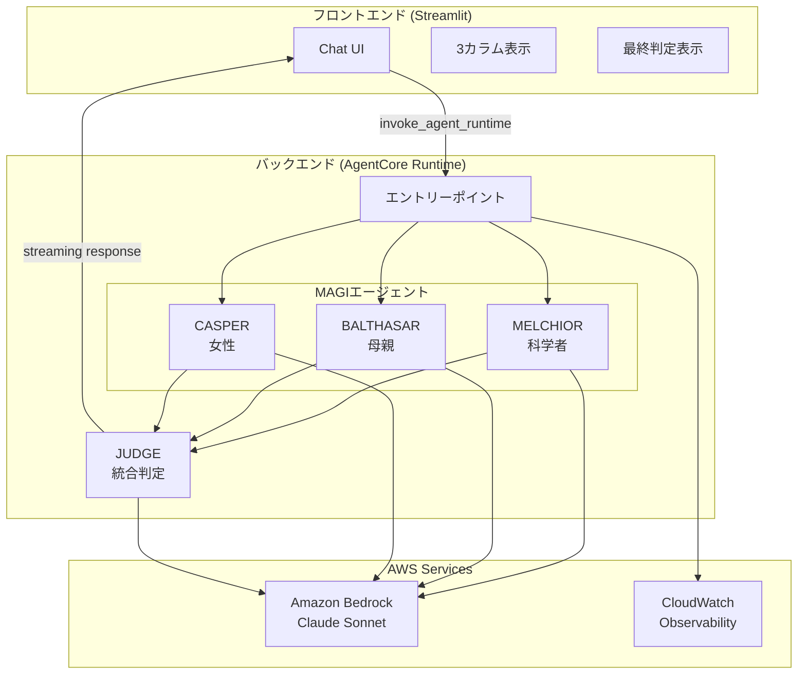

# Design Document: MAGI System

## Overview

MAGIシステムは、エヴァンゲリオンに登場するMAGIシステムをモチーフにした多角的判定AIシステムである。3つの異なる人格を持つAIエージェント（MELCHIOR、BALTHASAR、CASPER）がユーザーの問いかけを分析し、最終的な統合判定を提供する。

システムは以下の2つのコンポーネントで構成される：
- **バックエンド**: Strands Agents SDK + Amazon Bedrock AgentCore Runtime
- **フロントエンド**: Streamlit + Light Mode/Evangelion風カラー

## 開発フェーズ

4段階で開発を進める。各段階でAgentCoreをデプロイし、Streamlitローカル起動で動作確認を行う。

| Phase | 内容 | 主要機能 |
|-------|------|----------|
| 1 | 判定モード | 3エージェント判定 + 最終判定 + ストリーミング + 思考表示 |
| 2 | 会話モード追加 | 判定なしの自由対話 + モード切り替え |
| 3 | ロール設定 | 各エージェントのペルソナカスタマイズ |
| 4 | モデル設定 | 各エージェントの使用モデル選択 |

### 実装分担

| Part | 担当 | 内容 |
|------|------|------|
| Part A | Kiro実装 | フロントエンド（Streamlit UI、API呼び出し） |
| Part B | 学習用：自己実装 | バックエンド（AgentCore + Strands Agents） |

> 💡 Part B（バックエンド）は学習用として自己実装しますが、Kiroがサポートします。
> 質問、コードレビュー、デバッグなど、いつでも相談可能です。

## Architecture



## Components and Interfaces

### Backend Components (Part B: 学習用：自己実装)

> 💡 以下のコードは実装の参考例です。学習用として自分で実装してください。
> 不明点があればKiroに質問してください。

#### 1. MAGIエージェント基底クラス

```python
from strands import Agent
from dataclasses import dataclass

@dataclass
class AgentVerdict:
    """エージェントの判定結果"""
    agent_name: str      # エージェント名
    verdict: str         # "賛成" | "反対"
    reasoning: str       # 判定理由
    confidence: float    # 確信度 (0.0-1.0)

class MAGIAgent:
    """MAGIエージェントの基底クラス"""
    
    def __init__(self, name: str, persona: str, model_id: str):
        self.name = name
        self.persona = persona
        self.agent = Agent(
            model=model_id,
            system_prompt=self._build_system_prompt()
        )
    
    def _build_system_prompt(self) -> str:
        """ペルソナに基づくシステムプロンプトを構築"""
        pass
    
    async def analyze(self, question: str) -> AgentVerdict:
        """問いかけを分析し判定を返す"""
        pass
```

#### 2. MELCHIOR（科学者）

```python
class MelchiorAgent(MAGIAgent):
    """科学者の人格を持つエージェント"""
    
    SYSTEM_PROMPT = """
    あなたはMAGIシステムのMELCHIOR-1です。
    赤木ナオコ博士の科学者としての人格を持ちます。
    
    分析の観点：
    - 論理的整合性
    - 科学的根拠
    - データに基づく客観的判断
    - リスクの定量的評価
    
    回答形式：
    - verdict: "賛成" または "反対"
    - reasoning: 論理的な理由（200文字以内）
    - confidence: 確信度（0.0-1.0）
    """
```

#### 3. BALTHASAR（母親）

```python
class BalthasarAgent(MAGIAgent):
    """母親の人格を持つエージェント"""
    
    SYSTEM_PROMPT = """
    あなたはMAGIシステムのBALTHASAR-2です。
    赤木ナオコ博士の母親としての人格を持ちます。
    
    分析の観点：
    - 安全性と保護
    - 長期的な影響
    - 関係者への配慮
    - リスク回避
    
    回答形式：
    - verdict: "賛成" または "反対"
    - reasoning: 保護的観点からの理由（200文字以内）
    - confidence: 確信度（0.0-1.0）
    """
```

#### 4. CASPER（女性）

```python
class CasperAgent(MAGIAgent):
    """女性の人格を持つエージェント"""
    
    SYSTEM_PROMPT = """
    あなたはMAGIシステムのCASPER-3です。
    赤木ナオコ博士の女性としての人格を持ちます。
    
    分析の観点：
    - 人間的な感情
    - 社会的影響
    - 倫理的配慮
    - 共感と理解
    
    回答形式：
    - verdict: "賛成" または "反対"
    - reasoning: 人間的観点からの理由（200文字以内）
    - confidence: 確信度（0.0-1.0）
    """
```

#### 5. JUDGE（統合判定と対話）

```python
@dataclass
class FinalVerdict:
    """最終判定結果"""
    verdict: str           # "承認" | "否決" | "保留"
    summary: str           # 統合サマリー
    vote_count: dict       # {"賛成": n, "反対": m}
    agent_verdicts: list   # 各エージェントの判定

@dataclass
class ConversationContext:
    """会話コンテキスト"""
    history: list[dict]    # 過去の会話履歴
    last_verdict: FinalVerdict | None  # 前回の判定結果

class JudgeComponent:
    """3エージェントの判定を統合し、対話を管理"""
    
    def integrate(self, verdicts: list[AgentVerdict]) -> FinalVerdict:
        """多数決で最終判定を決定"""
        approve_count = sum(1 for v in verdicts if v.verdict == "賛成")
        reject_count = len(verdicts) - approve_count
        
        if approve_count > reject_count:
            final = "承認"
        elif reject_count > approve_count:
            final = "否決"
        else:
            final = "保留"
        
        return FinalVerdict(
            verdict=final,
            summary=self._generate_summary(verdicts, final),
            vote_count={"賛成": approve_count, "反対": reject_count},
            agent_verdicts=verdicts
        )
    
    def handle_followup(self, question: str, context: ConversationContext) -> str:
        """フォローアップ質問に対応"""
        # 前回の判定を踏まえた回答を生成
        pass
```

#### 6. バックエンドエントリーポイント（モード分岐対応）

```python
from bedrock_agentcore import BedrockAgentCoreApp
from dataclasses import dataclass

@dataclass
class AgentConfig:
    """エージェント設定"""
    role: str = None           # カスタムロール（None=デフォルト）
    model_id: str = "anthropic.claude-sonnet-4-20250514-v1:0"

@dataclass
class MAGIRequest:
    """MAGIリクエスト"""
    question: str
    mode: str = "judge"        # "judge" | "chat"
    conversation_history: list = None
    agent_configs: dict = None  # {"melchior": AgentConfig, ...}

app = BedrockAgentCoreApp()

@app.handler
async def magi_handler(request: MAGIRequest) -> AsyncGenerator:
    """MAGIシステムのメインハンドラー（ストリーミング対応）"""
    
    # エージェント設定の適用
    configs = request.agent_configs or {}
    melchior = MelchiorAgent(config=configs.get("melchior"))
    balthasar = BalthasarAgent(config=configs.get("balthasar"))
    casper = CasperAgent(config=configs.get("casper"))
    
    if request.mode == "judge":
        # 判定モード
        async for chunk in run_judge_mode(
            request.question,
            [melchior, balthasar, casper],
            request.conversation_history
        ):
            yield chunk
    else:
        # 会話モード
        async for chunk in run_chat_mode(
            request.question,
            [melchior, balthasar, casper],
            request.conversation_history
        ):
            yield chunk

async def run_judge_mode(question, agents, history) -> AsyncGenerator:
    """判定モード: 思考→判定→最終判定をストリーミング"""
    verdicts = []
    
    for agent in agents:
        # 思考プロセスをストリーミング
        yield {"type": "thinking", "agent": agent.name, "content": f"{agent.name}が分析中..."}
        
        async for thought in agent.think(question, history):
            yield {"type": "thinking", "agent": agent.name, "content": thought}
        
        # 判定結果
        verdict = await agent.judge(question, history)
        verdicts.append(verdict)
        yield {"type": "verdict", "agent": agent.name, "data": asdict(verdict)}
    
    # 最終判定
    judge = JudgeComponent()
    final = judge.integrate(verdicts)
    yield {"type": "final", "data": asdict(final)}

async def run_chat_mode(question, agents, history) -> AsyncGenerator:
    """会話モード: 各エージェントの回答をストリーミング"""
    for agent in agents:
        yield {"type": "thinking", "agent": agent.name, "content": f"{agent.name}が回答を準備中..."}
        
        async for chunk in agent.respond(question, history):
            yield {"type": "response", "agent": agent.name, "content": chunk}
```

### Frontend Components (Part A: Kiro実装)

#### 1. アプリケーション構造

```
frontend/
├── frontend.py          # メインアプリケーション
├── components/
│   ├── header.py        # ヘッダーコンポーネント
│   ├── agent_card.py    # エージェントカード
│   ├── final_verdict.py # 最終判定表示
│   └── chat.py          # チャットUI
├── styles/
│   └── theme.py         # カスタムCSS/テーマ
├── utils/
│   └── api.py           # AgentCore API呼び出し
├── requirements.txt
└── Dockerfile
```

#### 2. テーマ・スタイル定義（ライトモード + Evangelion風）

```python
# styles/theme.py

COLORS = {
    "background": "#F8FAFC",        # Light Gray
    "surface": "#FFFFFF",           # White
    "melchior": "#0891B2",          # Cyan (科学者)
    "balthasar": "#DC2626",         # Red (母親)
    "casper": "#7C3AED",            # Purple (女性)
    "nerv_accent": "#F97316",       # Orange (NERV風アクセント)
    "text_primary": "#1E293B",      # Dark Gray
    "text_secondary": "#64748B",    # Medium Gray
    "success": "#22C55E",
    "error": "#EF4444",
    "warning": "#F59E0B",
    "border": "#E2E8F0",            # Light Border
}

CARD_STYLE = """
    background: #FFFFFF;
    border: 2px solid {agent_color};
    border-radius: 12px;
    box-shadow: 0 1px 3px rgba(0, 0, 0, 0.1);
"""
```


## Data Models

### Streaming Response Schema

ストリーミングレスポンスは以下の形式でチャンクを返却する：

```json
// 思考プロセス（各エージェント）
{"type": "thinking", "agent": "MELCHIOR", "content": "論理的整合性を分析中..."}

// 判定結果（各エージェント）- 判定モードのみ
{"type": "verdict", "agent": "MELCHIOR", "data": {
  "agent_name": "MELCHIOR-1",
  "verdict": "賛成",
  "reasoning": "論理的分析に基づく理由...",
  "confidence": 0.85
}}

// 回答（各エージェント）- 会話モードのみ
{"type": "response", "agent": "MELCHIOR", "content": "回答テキスト..."}

// 最終判定 - 判定モードのみ
{"type": "final", "data": {
  "verdict": "承認",
  "summary": "2対1で承認。科学的妥当性と人間的価値を考慮...",
  "vote_count": {"賛成": 2, "反対": 1}
}}
```

### Agent Configuration Model

```python
@dataclass
class AgentConfig:
    """エージェント設定（Phase 3-4で使用）"""
    role: str | None = None        # カスタムロール（None=デフォルト）
    role_description: str | None = None  # ロールの詳細説明
    model_id: str = "anthropic.claude-sonnet-4-20250514-v1:0"

# デフォルトロールプリセット
DEFAULT_ROLES = {
    "melchior": {"role": "科学者", "description": "論理的・科学的観点から分析"},
    "balthasar": {"role": "母親", "description": "保護的・安全重視の観点から分析"},
    "casper": {"role": "女性", "description": "人間的・感情的観点から分析"},
}

# 利用可能モデル
AVAILABLE_MODELS = [
    {"id": "anthropic.claude-sonnet-4-20250514-v1:0", "name": "Claude Sonnet 4", "cost": "中"},
    {"id": "anthropic.claude-3-5-haiku-20241022-v1:0", "name": "Claude 3.5 Haiku", "cost": "低"},
    {"id": "anthropic.claude-3-5-sonnet-20241022-v2:0", "name": "Claude 3.5 Sonnet v2", "cost": "中"},
]
```

### API Request Schema

```python
@dataclass
class MAGIRequest:
    """MAGIリクエスト"""
    question: str
    mode: str = "judge"            # "judge" | "chat"
    conversation_history: list = None
    agent_configs: dict = None     # {"melchior": AgentConfig, ...}
```

### API Response Schema

```json
// 新規判定の場合
{
  "type": "verdict",
  "melchior": {
    "agent_name": "MELCHIOR-1",
    "verdict": "賛成",
    "reasoning": "論理的分析に基づく理由...",
    "confidence": 0.85
  },
  "balthasar": {
    "agent_name": "BALTHASAR-2",
    "verdict": "反対",
    "reasoning": "安全性の観点からの理由...",
    "confidence": 0.72
  },
  "casper": {
    "agent_name": "CASPER-3",
    "verdict": "賛成",
    "reasoning": "人間的観点からの理由...",
    "confidence": 0.68
  },
  "final": {
    "verdict": "承認",
    "summary": "2対1で承認。科学的妥当性と人間的価値を考慮...",
    "vote_count": {"賛成": 2, "反対": 1},
    "agent_verdicts": [...]
  },
  "timestamp": "2025-12-24T10:30:00"
}

// フォローアップ質問の場合
{
  "type": "followup",
  "response": "BALTHASARが反対した理由について詳しく説明します...",
  "timestamp": "2025-12-24T10:31:00"
}
```

### Session State Model

```python
@dataclass
class ChatMessage:
    """チャットメッセージ"""
    role: str              # "user" | "assistant"
    content: str           # メッセージ内容
    timestamp: datetime    # タイムスタンプ
    verdict_data: dict | None  # 判定データ（assistant の場合）

@dataclass
class SessionState:
    """Streamlitセッション状態"""
    messages: list[ChatMessage]    # チャット履歴
    runtime_arn: str               # AgentCore ARN
    demo_mode: bool                # デモモードフラグ
    current_response: dict | None  # 現在の応答
    is_loading: bool               # ローディング状態
    conversation_context: list[dict]  # バックエンドに送る会話コンテキスト
```

## Correctness Properties

*A property is a characteristic or behavior that should hold true across all valid executions of a system-essentially, a formal statement about what the system should do. Properties serve as the bridge between human-readable specifications and machine-verifiable correctness guarantees.*

### Property 1: エージェント判定の一貫性

*For any* 問いかけに対して、各エージェント（MELCHIOR、BALTHASAR、CASPER）は必ず「賛成」または「反対」のいずれかの判定を返す。

**Validates: Requirements 1.3, 2.3, 3.3**

### Property 2: 最終判定の多数決整合性

*For any* 3エージェントの判定結果に対して、最終判定は多数決の結果と一致する（賛成2以上で承認、反対2以上で否決、1対1対1で保留）。

**Validates: Requirements 4.2**

### Property 3: レスポンス構造の完全性

*For any* バックエンドからのレスポンスは、melchior、balthasar、casper、finalの4つのキーを必ず含む。

**Validates: Requirements 5.4**

### Property 4: UIフィードバックの即時性

*For any* ユーザー操作に対して、UIは0.4秒以内に何らかのフィードバック（ローディング表示、状態変化）を提供する。

**Validates: Requirements 9.4, 12.7**

### Property 5: セッション状態の保持と会話コンテキスト

*For any* チャット履歴は、同一セッション内で追加のみ行われ、削除されない（明示的なクリア操作を除く）。また、会話コンテキストはバックエンドに正しく送信される。

**Validates: Requirements 6.4, 6.7**

### Property 6: フォローアップ質問の文脈維持

*For any* フォローアップ質問に対して、システムは前回の判定結果を踏まえた一貫性のある回答を返す。

**Validates: Requirements 4.5, 4.6, 6.8**

## Error Handling

### Backend Errors

| エラー種別 | 原因 | 対処 |
|-----------|------|------|
| BedrockThrottlingError | API制限超過 | 指数バックオフでリトライ |
| AgentTimeoutError | エージェント応答タイムアウト | 30秒でタイムアウト、エラー返却 |
| InvalidResponseError | 不正なJSON形式 | デフォルト判定を返却 |

### Frontend Errors

| エラー種別 | 原因 | 対処 |
|-----------|------|------|
| ConnectionError | バックエンド接続失敗 | エラーメッセージ表示、リトライボタン |
| StreamingError | ストリーミング中断 | 部分データ表示、再試行促進 |
| ARNNotConfigured | ARN未設定 | 警告表示、デモモード提案 |

## Testing Strategy

### Unit Tests

- 各エージェントのシステムプロンプト生成
- JUDGE統合ロジック（多数決計算）
- レスポンスJSONのパース
- UIコンポーネントのレンダリング

### Property-Based Tests

- **Property 1**: ランダムな問いかけに対するエージェント判定の形式検証
- **Property 2**: ランダムな判定組み合わせに対する最終判定の整合性検証
- **Property 3**: レスポンス構造の完全性検証

### Integration Tests

- フロントエンド→バックエンド→Bedrock の一連のフロー
- ストリーミングレスポンスの正常受信
- デモモードの動作確認

### Testing Framework

- **Python**: pytest + hypothesis（Property-Based Testing）
- **Frontend**: pytest + streamlit-testing-library
