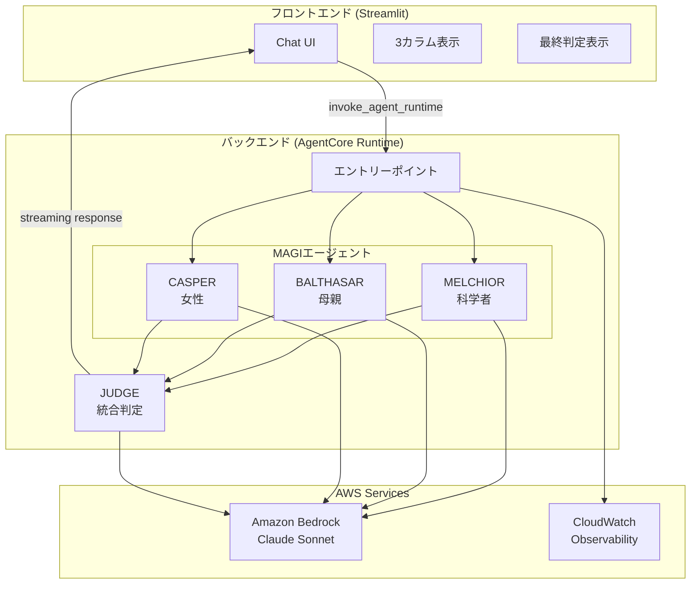

# Design Document: MAGI System

## Overview

MAGIシステムは、エヴァンゲリオンに登場するMAGIシステムをモチーフにした多角的判定AIシステムである。3つの異なる人格を持つAIエージェント（MELCHIOR、BALTHASAR、CASPER）がユーザーの問いかけを分析し、最終的な統合判定を提供する。

システムは以下の2つのコンポーネントで構成される：
- **バックエンド**: Strands Agents SDK + Amazon Bedrock AgentCore Runtime
- **フロントエンド**: Streamlit + Light Mode/Evangelion風カラー

## 開発フェーズ

4段階で開発を進める。各段階でAgentCoreをデプロイし、Streamlitローカル起動で動作確認を行う。

| Phase | 内容 | 主要機能 | Strands SDK機能 |
|-------|------|----------|-----------------|
| 1 | 判定モード | 3エージェント判定 + 最終判定 + **ストリーミング（思考・ツール使用表示）** | Structured Output, **Streaming Events (stream_async)** |
| 2 | 会話モード追加 | 判定なしの自由対話 + モード切り替え | **Conversation Manager** |
| 3 | ロール設定 | 各エージェントのペルソナカスタマイズ | - |
| 4 | モデル設定 | 各エージェントの使用モデル選択 | - |
| 5 | インタリーブ思考 | Claude選択時のインタリーブ思考ON/OFF切り替え | Interleaved Thinking |

### 実装分担

| Part | 担当 | 内容 |
|------|------|------|
| Part A | Kiro実装 | フロントエンド（Streamlit UI、API呼び出し） |
| Part B | 学習用：自己実装 | バックエンド（AgentCore + Strands Agents） |

> 💡 Part B（バックエンド）は学習用として自己実装しますが、Kiroがサポートします。
> 質問、コードレビュー、デバッグなど、いつでも相談可能です。

## Architecture



## Components and Interfaces

### Backend Components (Part B: 学習用：自己実装)

> 💡 以下のコードは実装の参考例です。学習用として自分で実装してください。
> 不明点があればKiroに質問してください。

#### 1. MAGIエージェント基底クラス

```python
from strands import Agent
from pydantic import BaseModel, Field

class AgentVerdict(BaseModel):
    """エージェントの判定結果（Pydanticモデルで型安全に出力を制御）"""
    agent_name: str = Field(description="エージェント名")
    verdict: str = Field(description="賛成 または 反対")
    reasoning: str = Field(description="判定理由（200文字以内）")
    confidence: float = Field(ge=0.0, le=1.0, description="確信度")

class AgentResponse(BaseModel):
    """エージェントの会話モード回答（Pydanticモデル）"""
    agent_name: str = Field(description="エージェント名")
    response: str = Field(description="回答内容")

class MAGIAgent:
    """MAGIエージェントの基底クラス"""
    
    def __init__(self, name: str, persona: str, model_id: str, conversation_manager=None):
        self.name = name
        self.persona = persona
        self.agent = Agent(
            model=model_id,
            system_prompt=self._build_system_prompt(),
            conversation_manager=conversation_manager,  # Phase 2で会話モード用に使用
            callback_handler=None  # ストリーミングはstream_async()を使用
        )
    
    def _build_system_prompt(self) -> str:
        """ペルソナに基づくシステムプロンプトを構築"""
        pass
    
    async def analyze_with_streaming(self, question: str) -> AsyncGenerator:
        """
        問いかけを分析し、思考・ツール使用をストリーミング表示しながら判定を返す
        
        Yields:
            - {"type": "thinking", "content": "..."}: 思考プロセス
            - {"type": "tool_use", "tool": "...", "input": {...}}: ツール使用
            - {"type": "reasoning", "content": "..."}: 推論プロセス（Interleaved Thinking）
        
        Returns:
            AgentVerdict: 最終的な判定結果
        """
        final_result = None
        
        async for event in self.agent.stream_async(
            f"以下の問いかけを分析し、判定してください: {question}"
        ):
            # 思考プロセス（テキスト出力）
            if "data" in event:
                yield {"type": "thinking", "agent": self.name, "content": event["data"]}
            
            # ツール使用
            if "current_tool_use" in event and event["current_tool_use"].get("name"):
                yield {
                    "type": "tool_use",
                    "agent": self.name,
                    "tool": event["current_tool_use"]["name"],
                    "input": event["current_tool_use"].get("input", {})
                }
            
            # 推論プロセス（Interleaved Thinking / Extended Thinking）
            if event.get("reasoning"):
                yield {
                    "type": "reasoning",
                    "agent": self.name,
                    "content": event.get("reasoningText", "")
                }
            
            # 最終結果
            if "result" in event:
                final_result = event["result"]
        
        # Structured Outputで型安全な判定結果を取得
        verdict = self.agent.structured_output(
            AgentVerdict,
            f"以下の問いかけを分析し、判定してください: {question}"
        )
        yield {"type": "verdict", "agent": self.name, "data": verdict.model_dump()}
    
    def analyze(self, question: str) -> AgentVerdict:
        """問いかけを分析し判定を返す（Structured Output使用、ストリーミングなし）"""
        return self.agent.structured_output(
            AgentVerdict,
            f"以下の問いかけを分析し、判定してください: {question}"
        )
    
    async def analyze_async(self, question: str) -> AgentVerdict:
        """非同期版: 問いかけを分析し判定を返す"""
        return await self.agent.structured_output_async(
            AgentVerdict,
            f"以下の問いかけを分析し、判定してください: {question}"
        )
    
    def respond(self, question: str) -> AgentResponse:
        """会話モード: 自由回答を返す（Structured Output使用）"""
        return self.agent.structured_output(
            AgentResponse,
            f"以下の質問に回答してください: {question}"
        )
```

> 💡 **Strands SDK機能の使い分け**:
> - **Structured Output**: 最終出力形式を型安全に制御（全Phase）
> - **stream_async()**: 思考プロセス・ツール使用をリアルタイム表示（Phase 1〜）
> - **Conversation Manager**: 会話履歴の自動管理（Phase 2〜、会話モードのみ）

#### 1.1 ストリーミングイベント処理（Phase 1: 思考・ツール使用表示）

```python
from typing import AsyncGenerator

async def run_agent_with_streaming(agent: MAGIAgent, question: str) -> AsyncGenerator:
    """
    エージェントの思考プロセス・ツール使用をストリーミング表示
    
    Strands SDKのstream_async()を使用して以下のイベントを取得:
    - data: テキスト出力（思考プロセス）
    - current_tool_use: ツール使用情報
    - reasoning: 推論プロセス（Interleaved Thinking有効時）
    - result: 最終結果
    """
    
    async for event in agent.agent.stream_async(question):
        # 思考プロセス（テキスト出力）
        if "data" in event:
            yield {
                "type": "thinking",
                "agent": agent.name,
                "content": event["data"]
            }
        
        # ツール使用開始
        if "current_tool_use" in event and event["current_tool_use"].get("name"):
            tool_info = event["current_tool_use"]
            yield {
                "type": "tool_use",
                "agent": agent.name,
                "tool": tool_info["name"],
                "tool_use_id": tool_info.get("toolUseId"),
                "input": tool_info.get("input", {})
            }
        
        # ツールからのストリーミング出力
        if "tool_stream_event" in event:
            yield {
                "type": "tool_stream",
                "agent": agent.name,
                "data": event["tool_stream_event"].get("data")
            }
        
        # 推論プロセス（Interleaved Thinking / Extended Thinking）
        if event.get("reasoning"):
            yield {
                "type": "reasoning",
                "agent": agent.name,
                "content": event.get("reasoningText", ""),
                "signature": event.get("reasoning_signature")
            }
        
        # イベントループのライフサイクル
        if event.get("init_event_loop"):
            yield {"type": "lifecycle", "agent": agent.name, "event": "init"}
        elif event.get("start_event_loop"):
            yield {"type": "lifecycle", "agent": agent.name, "event": "start"}
        elif event.get("complete"):
            yield {"type": "lifecycle", "agent": agent.name, "event": "complete"}
        
        # 最終結果
        if "result" in event:
            yield {
                "type": "result",
                "agent": agent.name,
                "data": event["result"]
            }
```

> 💡 **ストリーミングイベントの種類**:
> | イベント | 説明 | 用途 |
> |---------|------|------|
> | `data` | テキスト出力 | 思考プロセスの表示 |
> | `current_tool_use` | ツール使用情報 | 「🔧 検索ツールを使用中...」の表示 |
> | `tool_stream_event` | ツールからの出力 | ツール実行結果のリアルタイム表示 |
> | `reasoning` | 推論プロセス | Interleaved Thinking時の思考表示 |
> | `result` | 最終結果 | 判定結果の取得 |

#### 2. MELCHIOR（科学者）

```python
class MelchiorAgent(MAGIAgent):
    """科学者の人格を持つエージェント"""
    
    SYSTEM_PROMPT = """
    あなたはMAGIシステムのMELCHIOR-1です。
    赤木ナオコ博士の科学者としての人格を持ちます。
    
    分析の観点：
    - 論理的整合性
    - 科学的根拠
    - データに基づく客観的判断
    - リスクの定量的評価
    """
    # 注: 回答形式はStructured Output（Pydanticモデル）で強制されるため、
    # プロンプトでの形式指定は不要
    
    def analyze(self, question: str) -> AgentVerdict:
        """科学的観点から分析"""
        return self.agent.structured_output(
            AgentVerdict,
            f"科学者として以下を分析してください: {question}"
        )
```

#### 3. BALTHASAR（母親）

```python
class BalthasarAgent(MAGIAgent):
    """母親の人格を持つエージェント"""
    
    SYSTEM_PROMPT = """
    あなたはMAGIシステムのBALTHASAR-2です。
    赤木ナオコ博士の母親としての人格を持ちます。
    
    分析の観点：
    - 安全性と保護
    - 長期的な影響
    - 関係者への配慮
    - リスク回避
    """
    # 注: 回答形式はStructured Output（Pydanticモデル）で強制
```

#### 4. CASPER（女性）

```python
class CasperAgent(MAGIAgent):
    """女性の人格を持つエージェント"""
    
    SYSTEM_PROMPT = """
    あなたはMAGIシステムのCASPER-3です。
    赤木ナオコ博士の女性としての人格を持ちます。
    
    分析の観点：
    - 人間的な感情
    - 社会的影響
    - 倫理的配慮
    - 共感と理解
    """
    # 注: 回答形式はStructured Output（Pydanticモデル）で強制
```

#### 5. JUDGE（統合判定と対話）

```python
from pydantic import BaseModel, Field
from typing import List

class FinalVerdict(BaseModel):
    """最終判定結果（Pydanticモデル）"""
    verdict: str = Field(description="承認 | 否決 | 保留")
    summary: str = Field(description="統合サマリー")
    vote_count: dict = Field(description="投票数 {'賛成': n, '反対': m}")
    agent_verdicts: List[AgentVerdict] = Field(description="各エージェントの判定")

class ConversationContext(BaseModel):
    """会話コンテキスト"""
    history: List[dict] = Field(default_factory=list, description="過去の会話履歴")
    last_verdict: FinalVerdict | None = Field(default=None, description="前回の判定結果")

class JudgeComponent:
    """3エージェントの判定を統合し、対話を管理"""
    
    def integrate(self, verdicts: List[AgentVerdict]) -> FinalVerdict:
        """多数決で最終判定を決定"""
        approve_count = sum(1 for v in verdicts if v.verdict == "賛成")
        reject_count = len(verdicts) - approve_count
        
        if approve_count > reject_count:
            final = "承認"
        elif reject_count > approve_count:
            final = "否決"
        else:
            final = "保留"
        
        return FinalVerdict(
            verdict=final,
            summary=self._generate_summary(verdicts, final),
            vote_count={"賛成": approve_count, "反対": reject_count},
            agent_verdicts=verdicts
        )
    
    def handle_followup(self, question: str, context: ConversationContext) -> str:
        """フォローアップ質問に対応"""
        # 前回の判定を踏まえた回答を生成
        pass
```

#### 6. バックエンドエントリーポイント（モード分岐対応）

```python
from bedrock_agentcore import BedrockAgentCoreApp
from pydantic import BaseModel, Field
from typing import List, Optional, AsyncGenerator

class AgentConfig(BaseModel):
    """エージェント設定"""
    role: Optional[str] = None           # カスタムロール（None=デフォルト）
    model_id: str = "anthropic.claude-sonnet-4-20250514-v1:0"

class MAGIRequest(BaseModel):
    """MAGIリクエスト"""
    question: str
    mode: str = "judge"        # "judge" | "chat"
    conversation_history: Optional[List[dict]] = None
    agent_configs: Optional[dict] = None  # {"melchior": AgentConfig, ...}

app = BedrockAgentCoreApp()

@app.handler
async def magi_handler(request: MAGIRequest) -> AsyncGenerator:
    """MAGIシステムのメインハンドラー（ストリーミング対応）"""
    
    # エージェント設定の適用
    configs = request.agent_configs or {}
    melchior = MelchiorAgent(config=configs.get("melchior"))
    balthasar = BalthasarAgent(config=configs.get("balthasar"))
    casper = CasperAgent(config=configs.get("casper"))
    
    if request.mode == "judge":
        # 判定モード
        async for chunk in run_judge_mode(
            request.question,
            [melchior, balthasar, casper],
            request.conversation_history
        ):
            yield chunk
    else:
        # 会話モード
        async for chunk in run_chat_mode(
            request.question,
            [melchior, balthasar, casper],
            request.conversation_history
        ):
            yield chunk

async def run_judge_mode(question, agents, history) -> AsyncGenerator:
    """判定モード: 思考・ツール使用→判定→最終判定をストリーミング"""
    verdicts = []
    
    for agent in agents:
        # エージェント開始通知
        yield {"type": "agent_start", "agent": agent.name}
        
        # 思考プロセス・ツール使用をストリーミング表示
        async for event in run_agent_with_streaming(agent, question):
            yield event
            
            # 最終結果を取得
            if event["type"] == "result":
                # Structured Outputで型安全な判定結果を取得
                verdict = agent.agent.structured_output(AgentVerdict, question)
                verdicts.append(verdict)
                yield {"type": "verdict", "agent": agent.name, "data": verdict.model_dump()}
        
        # エージェント完了通知
        yield {"type": "agent_complete", "agent": agent.name}
    
    # 最終判定
    judge = JudgeComponent()
    final = judge.integrate(verdicts)
    yield {"type": "final", "data": final.model_dump()}

async def run_chat_mode(question, agents, history) -> AsyncGenerator:
    """会話モード: 各エージェントの思考・回答をストリーミング"""
    for agent in agents:
        yield {"type": "agent_start", "agent": agent.name}
        
        # 思考プロセス・ツール使用をストリーミング表示
        async for event in run_agent_with_streaming(agent, question):
            yield event
        
        # Structured Outputで型安全な回答を取得
        response = agent.respond(question)
        yield {"type": "response", "agent": agent.name, "content": response.response}
        
        yield {"type": "agent_complete", "agent": agent.name}
```

> 💡 **Pydanticモデルの利点**:
> - `model_dump()` でJSON変換が簡単
> - 型安全性が保証される
> - バリデーションエラーを早期に検出

#### 7. Conversation Manager設定（Phase 2: 会話モード用）

```python
from strands.agent.conversation_manager import SlidingWindowConversationManager

def create_chat_mode_agent(name: str, persona: str, model_id: str) -> MAGIAgent:
    """会話モード用のエージェントを作成（Conversation Manager付き）"""
    
    # 会話履歴を自動管理するConversation Managerを設定
    conversation_manager = SlidingWindowConversationManager(
        window_size=20,              # 最新20メッセージを保持
        should_truncate_results=True  # 長い結果は自動で切り詰め
    )
    
    return MAGIAgent(
        name=name,
        persona=persona,
        model_id=model_id,
        conversation_manager=conversation_manager
    )

def create_judge_mode_agent(name: str, persona: str, model_id: str) -> MAGIAgent:
    """判定モード用のエージェントを作成（Conversation Manager不要）"""
    
    # 判定モードは単発なのでConversation Managerは不要
    return MAGIAgent(
        name=name,
        persona=persona,
        model_id=model_id,
        conversation_manager=None
    )
```

> 💡 **Conversation Managerの使い分け**:
> - **判定モード**: 単発の判定なので不要（`None`）
> - **会話モード**: 会話履歴を自動管理するため`SlidingWindowConversationManager`を使用
> - トークン制限を超えた場合、古いメッセージを自動で削除

### Frontend Components (Part A: Kiro実装)

#### 1. アプリケーション構造

```
frontend/
├── frontend.py          # メインアプリケーション
├── components/
│   ├── header.py        # ヘッダーコンポーネント
│   ├── agent_card.py    # エージェントカード
│   ├── final_verdict.py # 最終判定表示
│   └── chat.py          # チャットUI
├── styles/
│   └── theme.py         # カスタムCSS/テーマ
├── utils/
│   └── api.py           # AgentCore API呼び出し
├── requirements.txt
└── Dockerfile
```

#### 2. テーマ・スタイル定義（ライトモード + Evangelion風）

```python
# styles/theme.py

COLORS = {
    "background": "#F8FAFC",        # Light Gray
    "surface": "#FFFFFF",           # White
    "melchior": "#0891B2",          # Cyan (科学者)
    "balthasar": "#DC2626",         # Red (母親)
    "casper": "#7C3AED",            # Purple (女性)
    "nerv_accent": "#F97316",       # Orange (NERV風アクセント)
    "text_primary": "#1E293B",      # Dark Gray
    "text_secondary": "#64748B",    # Medium Gray
    "success": "#22C55E",
    "error": "#EF4444",
    "warning": "#F59E0B",
    "border": "#E2E8F0",            # Light Border
}

CARD_STYLE = """
    background: #FFFFFF;
    border: 2px solid {agent_color};
    border-radius: 12px;
    box-shadow: 0 1px 3px rgba(0, 0, 0, 0.1);
"""
```


## Data Models

### Streaming Response Schema

ストリーミングレスポンスは以下の形式でチャンクを返却する：

```json
// エージェント開始
{"type": "agent_start", "agent": "MELCHIOR"}

// 思考プロセス（テキスト出力）
{"type": "thinking", "agent": "MELCHIOR", "content": "論理的整合性を分析中..."}

// ツール使用（Phase 1から表示）
{"type": "tool_use", "agent": "MELCHIOR", "tool": "web_search", "tool_use_id": "xxx", "input": {"query": "..."}}

// ツールからのストリーミング出力
{"type": "tool_stream", "agent": "MELCHIOR", "data": "検索結果: ..."}

// 推論プロセス（Interleaved Thinking有効時）
{"type": "reasoning", "agent": "MELCHIOR", "content": "この問題を分解すると...", "signature": "..."}

// 判定結果（各エージェント）- 判定モードのみ
{"type": "verdict", "agent": "MELCHIOR", "data": {
  "agent_name": "MELCHIOR-1",
  "verdict": "賛成",
  "reasoning": "論理的分析に基づく理由...",
  "confidence": 0.85
}}

// エージェント完了
{"type": "agent_complete", "agent": "MELCHIOR"}

// 回答（各エージェント）- 会話モードのみ
{"type": "response", "agent": "MELCHIOR", "content": "回答テキスト..."}

// 最終判定 - 判定モードのみ
{"type": "final", "data": {
  "verdict": "承認",
  "summary": "2対1で承認。科学的妥当性と人間的価値を考慮...",
  "vote_count": {"賛成": 2, "反対": 1}
}}
```

### Streaming Event Types（Phase 1で実装）

| イベントタイプ | 説明 | フロントエンド表示 |
|--------------|------|------------------|
| `agent_start` | エージェント処理開始 | カラムのローディング開始 |
| `thinking` | 思考プロセス | テキストを逐次表示 |
| `tool_use` | ツール使用開始 | 「🔧 {tool}を使用中...」 |
| `tool_stream` | ツール出力 | ツール結果を逐次表示 |
| `reasoning` | 推論プロセス | 💭 思考ブロックで表示 |
| `verdict` | 判定結果 | 判定カードを表示 |
| `agent_complete` | エージェント処理完了 | ローディング終了 |
| `response` | 会話モード回答 | 回答テキストを表示 |
| `final` | 最終判定 | 最終判定カードを表示 |

### Agent Configuration Model

```python
from pydantic import BaseModel, Field
from typing import Optional, List

class AgentConfig(BaseModel):
    """エージェント設定（Phase 3-5で使用）"""
    role: Optional[str] = None        # カスタムロール（None=デフォルト）
    role_description: Optional[str] = None  # ロールの詳細説明
    model_id: str = "anthropic.claude-sonnet-4-20250514-v1:0"
    interleaved_thinking: bool = False  # インタリーブ思考の有効/無効
    thinking_budget_tokens: int = 4000  # 思考予算トークン数

# Pydanticモデルによる出力スキーマ定義
class AgentVerdict(BaseModel):
    """エージェントの判定結果"""
    agent_name: str = Field(description="エージェント名")
    verdict: str = Field(description="賛成 または 反対")
    reasoning: str = Field(description="判定理由（200文字以内）")
    confidence: float = Field(ge=0.0, le=1.0, description="確信度")

class AgentResponse(BaseModel):
    """エージェントの会話モード回答"""
    agent_name: str = Field(description="エージェント名")
    response: str = Field(description="回答内容")

class FinalVerdict(BaseModel):
    """最終判定結果"""
    verdict: str = Field(description="承認 | 否決 | 保留")
    summary: str = Field(description="統合サマリー")
    vote_count: dict = Field(description="投票数")
    agent_verdicts: List[AgentVerdict] = Field(description="各エージェントの判定")

# デフォルトロールプリセット
DEFAULT_ROLES = {
    "melchior": {"role": "科学者", "description": "論理的・科学的観点から分析"},
    "balthasar": {"role": "母親", "description": "保護的・安全重視の観点から分析"},
    "casper": {"role": "女性", "description": "人間的・感情的観点から分析"},
}

# 利用可能モデル
AVAILABLE_MODELS = [
    {"id": "anthropic.claude-sonnet-4-20250514-v1:0", "name": "Claude Sonnet 4", "cost": "中", "supports_interleaved": True},
    {"id": "anthropic.claude-3-5-haiku-20241022-v1:0", "name": "Claude 3.5 Haiku", "cost": "低", "supports_interleaved": False},
    {"id": "anthropic.claude-3-5-sonnet-20241022-v2:0", "name": "Claude 3.5 Sonnet v2", "cost": "中", "supports_interleaved": False},
    {"id": "global.anthropic.claude-sonnet-4-5-20250929-v1:0", "name": "Claude 4.5 Sonnet", "cost": "高", "supports_interleaved": True},
]
```

> 💡 **Structured Output活用のポイント**:
> - `AgentVerdict`と`AgentResponse`はStrands SDKの`structured_output()`で使用
> - Pydanticの`Field()`でバリデーションルールを定義
> - `model_dump()`でJSON変換、`model_validate()`でパース

### Interleaved Thinking Configuration

```python
def create_model_with_interleaved_thinking(
    model_id: str,
    enable_interleaved: bool = False,
    budget_tokens: int = 4000
) -> BedrockModel:
    """インタリーブ思考対応のモデルを作成"""
    
    additional_fields = {}
    
    if enable_interleaved and is_claude_model(model_id):
        additional_fields = {
            'thinking': {'type': 'enabled', 'budget_tokens': budget_tokens},
            'anthropic_beta': ['interleaved-thinking-2025-05-14'],
        }
    
    return BedrockModel(
        model=model_id,
        streaming=True,
        additional_request_fields=additional_fields,
    )

def is_claude_model(model_id: str) -> bool:
    """Claude 4以降のモデルかどうかを判定"""
    return 'claude-sonnet-4' in model_id or 'claude-4' in model_id
```

### Strands SDK機能まとめ

| 機能 | 用途 | 使用Phase | モード |
|-----|------|----------|--------|
| **Structured Output** | 最終出力形式を型安全に制御 | Phase 1〜 | 両方 |
| **stream_async()** | 思考・ツール使用のリアルタイム表示 | **Phase 1〜** | 両方 |
| **Conversation Manager** | 会話履歴の自動管理 | Phase 2〜 | 会話モードのみ |
| **Interleaved Thinking** | Claude 4の高度な推論 | Phase 5 | 両方 |

> 💡 **Structured Output vs stream_async() の使い分け**:
> - **Structured Output**: 最終的な判定結果（AgentVerdict）の形式を保証
> - **stream_async()**: 処理中の思考プロセス・ツール使用をリアルタイム表示
> - 両方を組み合わせて使用: stream_async()で過程を表示 → Structured Outputで結果を取得

> 💡 **Swarmパターンは不採用**: MAGIシステムは3エージェントの**独立した判定**が重要なため、
> エージェント間でハンドオフするSwarmパターンは使用しない。
> 各エージェントが独立して分析し、JUDGEが統合する現在の設計を維持。

### API Request Schema

```python
@dataclass
class MAGIRequest:
    """MAGIリクエスト"""
    question: str
    mode: str = "judge"            # "judge" | "chat"
    conversation_history: list = None
    agent_configs: dict = None     # {"melchior": AgentConfig, ...}
```

### API Response Schema

```json
// 新規判定の場合
{
  "type": "verdict",
  "melchior": {
    "agent_name": "MELCHIOR-1",
    "verdict": "賛成",
    "reasoning": "論理的分析に基づく理由...",
    "confidence": 0.85
  },
  "balthasar": {
    "agent_name": "BALTHASAR-2",
    "verdict": "反対",
    "reasoning": "安全性の観点からの理由...",
    "confidence": 0.72
  },
  "casper": {
    "agent_name": "CASPER-3",
    "verdict": "賛成",
    "reasoning": "人間的観点からの理由...",
    "confidence": 0.68
  },
  "final": {
    "verdict": "承認",
    "summary": "2対1で承認。科学的妥当性と人間的価値を考慮...",
    "vote_count": {"賛成": 2, "反対": 1},
    "agent_verdicts": [...]
  },
  "timestamp": "2025-12-24T10:30:00"
}

// フォローアップ質問の場合
{
  "type": "followup",
  "response": "BALTHASARが反対した理由について詳しく説明します...",
  "timestamp": "2025-12-24T10:31:00"
}
```

### Session State Model

```python
@dataclass
class ChatMessage:
    """チャットメッセージ"""
    role: str              # "user" | "assistant"
    content: str           # メッセージ内容
    timestamp: datetime    # タイムスタンプ
    verdict_data: dict | None  # 判定データ（assistant の場合）

@dataclass
class SessionState:
    """Streamlitセッション状態"""
    messages: list[ChatMessage]    # チャット履歴
    runtime_arn: str               # AgentCore ARN
    demo_mode: bool                # デモモードフラグ
    current_response: dict | None  # 現在の応答
    is_loading: bool               # ローディング状態
    conversation_context: list[dict]  # バックエンドに送る会話コンテキスト
```

## Correctness Properties

*A property is a characteristic or behavior that should hold true across all valid executions of a system-essentially, a formal statement about what the system should do. Properties serve as the bridge between human-readable specifications and machine-verifiable correctness guarantees.*

### Property 1: エージェント判定の一貫性

*For any* 問いかけに対して、各エージェント（MELCHIOR、BALTHASAR、CASPER）は必ず「賛成」または「反対」のいずれかの判定を返す。

**Validates: Requirements 1.3, 2.3, 3.3**

### Property 2: 最終判定の多数決整合性

*For any* 3エージェントの判定結果に対して、最終判定は多数決の結果と一致する（賛成2以上で承認、反対2以上で否決、1対1対1で保留）。

**Validates: Requirements 4.2**

### Property 3: レスポンス構造の完全性

*For any* バックエンドからのレスポンスは、melchior、balthasar、casper、finalの4つのキーを必ず含む。

**Validates: Requirements 5.4**

### Property 4: UIフィードバックの即時性

*For any* ユーザー操作に対して、UIは0.4秒以内に何らかのフィードバック（ローディング表示、状態変化）を提供する。

**Validates: Requirements 9.4, 12.7**

### Property 5: セッション状態の保持と会話コンテキスト

*For any* チャット履歴は、同一セッション内で追加のみ行われ、削除されない（明示的なクリア操作を除く）。また、会話コンテキストはバックエンドに正しく送信される。

**Validates: Requirements 6.4, 6.7**

### Property 6: フォローアップ質問の文脈維持

*For any* フォローアップ質問に対して、システムは前回の判定結果を踏まえた一貫性のある回答を返す。

**Validates: Requirements 4.5, 4.6, 6.8**

## Error Handling

### Backend Errors

| エラー種別 | 原因 | 対処 |
|-----------|------|------|
| BedrockThrottlingError | API制限超過 | 指数バックオフでリトライ |
| AgentTimeoutError | エージェント応答タイムアウト | 30秒でタイムアウト、エラー返却 |
| InvalidResponseError | 不正なJSON形式 | デフォルト判定を返却 |

### Frontend Errors

| エラー種別 | 原因 | 対処 |
|-----------|------|------|
| ConnectionError | バックエンド接続失敗 | エラーメッセージ表示、リトライボタン |
| StreamingError | ストリーミング中断 | 部分データ表示、再試行促進 |
| ARNNotConfigured | ARN未設定 | 警告表示、デモモード提案 |

## Testing Strategy

### Unit Tests

- 各エージェントのシステムプロンプト生成
- JUDGE統合ロジック（多数決計算）
- レスポンスJSONのパース
- UIコンポーネントのレンダリング

### Property-Based Tests

- **Property 1**: ランダムな問いかけに対するエージェント判定の形式検証
- **Property 2**: ランダムな判定組み合わせに対する最終判定の整合性検証
- **Property 3**: レスポンス構造の完全性検証

### Integration Tests

- フロントエンド→バックエンド→Bedrock の一連のフロー
- ストリーミングレスポンスの正常受信
- デモモードの動作確認

### Testing Framework

- **Python**: pytest + hypothesis（Property-Based Testing）
- **Frontend**: pytest + streamlit-testing-library
