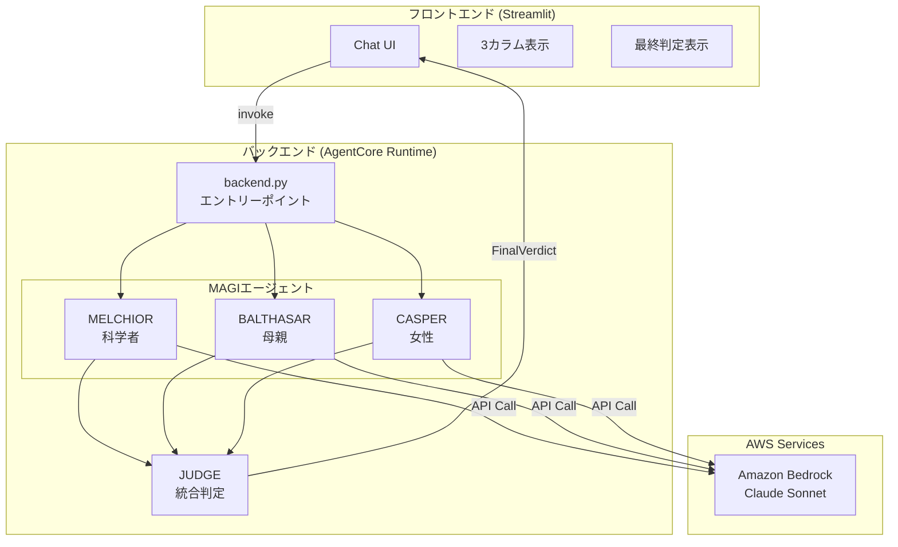
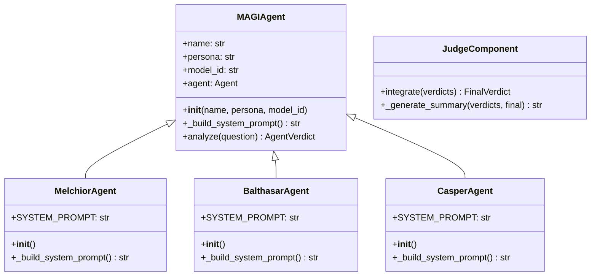
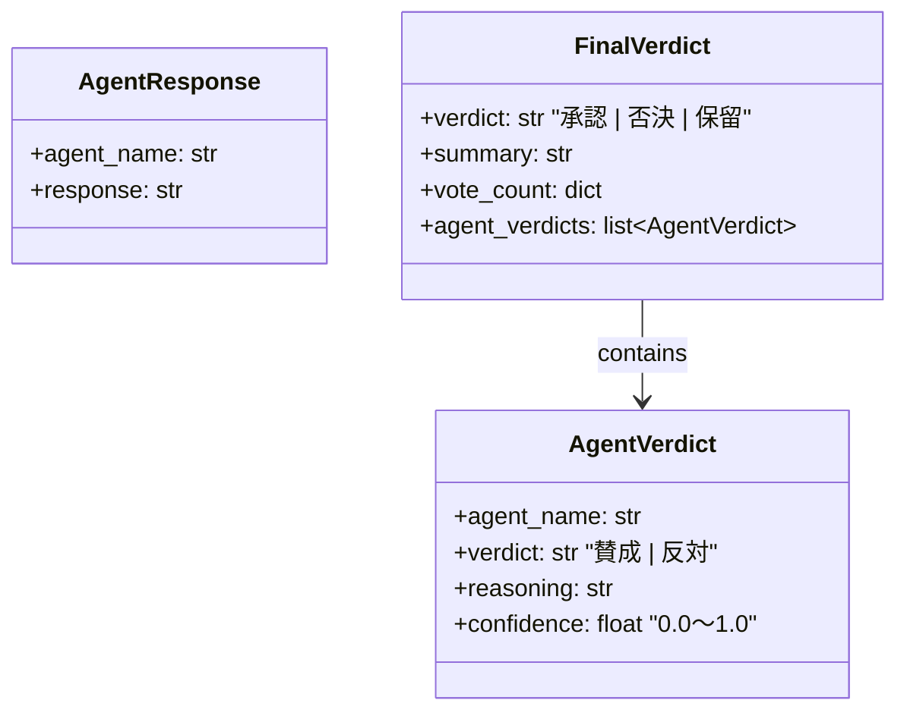

# MAGIシステム アーキテクチャ概要

## 1. システム全体図



---

## 2. 処理フロー（ASCII版）

```
┌─────────────────────────────────────────────────────────────────────────────┐
│  ユーザー: 「AIを業務に導入すべきか？」                                        │
└─────────────────────────────────────────────────────────────────────────────┘
                                    │
                                    ▼
┌─────────────────────────────────────────────────────────────────────────────┐
│  backend.py (ハンドラー)                                                     │
│  ─────────────────────────────────────────────────────────────────────────  │
│  1. 3つのエージェントを作成                                                  │
│     melchior = MelchiorAgent()                                              │
│     balthasar = BalthasarAgent()                                            │
│     casper = CasperAgent()                                                  │
│                                                                             │
│  2. 各エージェントのanalyze()を呼び出す                                       │
└─────────────────────────────────────────────────────────────────────────────┘
          │                         │                         │
          ▼                         ▼                         ▼
┌───────────────────┐   ┌───────────────────┐   ┌───────────────────┐
│  MELCHIOR         │   │  BALTHASAR        │   │  CASPER           │
│  .analyze(質問)   │   │  .analyze(質問)   │   │  .analyze(質問)   │
│        │          │   │        │          │   │        │          │
│        ▼          │   │        ▼          │   │        ▼          │
│  Bedrock API呼出  │   │  Bedrock API呼出  │   │  Bedrock API呼出  │
│        │          │   │        │          │   │        │          │
│        ▼          │   │        ▼          │   │        ▼          │
│  AgentVerdict     │   │  AgentVerdict     │   │  AgentVerdict     │
│  - verdict: 賛成  │   │  - verdict: 反対  │   │  - verdict: 賛成  │
│  - reasoning: ... │   │  - reasoning: ... │   │  - reasoning: ... │
│  - confidence:0.8 │   │  - confidence:0.7 │   │  - confidence:0.6 │
└───────────────────┘   └───────────────────┘   └───────────────────┘
          │                         │                         │
          └─────────────────────────┼─────────────────────────┘
                                    │
                                    ▼
┌─────────────────────────────────────────────────────────────────────────────┐
│  JUDGE.integrate([verdict1, verdict2, verdict3])                            │
│  ─────────────────────────────────────────────────────────────────────────  │
│  多数決: 賛成2 vs 反対1 → 承認                                               │
│                                                                             │
│  FinalVerdict                                                               │
│  - verdict: "承認"                                                          │
│  - summary: "科学的妥当性と人間的価値を考慮し..."                             │
│  - vote_count: {"賛成": 2, "反対": 1}                                        │
└─────────────────────────────────────────────────────────────────────────────┘
                                    │
                                    ▼
┌─────────────────────────────────────────────────────────────────────────────┐
│  フロントエンド（Streamlit）に返却                                           │
└─────────────────────────────────────────────────────────────────────────────┘
```

---

## 3. クラス構成



---

## 4. データモデル



---

## 5. 技術スタック

| レイヤー | 技術 | 役割 |
|---------|------|------|
| **フロントエンド** | Streamlit | UI、ユーザー入力、結果表示 |
| **バックエンド** | Strands Agents SDK | エージェント作成・実行 |
| **AI基盤** | Amazon Bedrock | Claude Sonnet 4 呼び出し |
| **デプロイ** | AgentCore Runtime | バックエンドホスティング |

---

## 6. 開発フェーズ

```mermaid
gantt
    title MAGIシステム開発フェーズ
    dateFormat  X
    axisFormat %s

    section Phase 1
    判定モード + ストリーミング    :done, p1, 0, 1

    section Phase 2
    会話モード追加                :p2, 1, 2

    section Phase 3
    ロール設定                    :p3, 2, 3

    section Phase 4
    モデル設定                    :p4, 3, 4

    section Phase 5
    インタリーブ思考              :p5, 4, 5
```



| フェーズ | 機能 | Strands SDK機能 |
|---------|------|-----------------|
| 1 | 判定モード + ストリーミング | Structured Output, stream_async |
| 2 | 会話モード | Conversation Manager |
| 3 | ロール設定 | - |
| 4 | モデル設定 | - |
| 5 | インタリーブ思考 | Interleaved Thinking |
