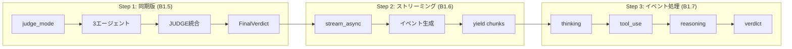

# 現在の進捗状況

## Phase 1 実装フロー



---

## 完了したタスク

### 1. MAGIAgent基底クラス ✅

**ファイル:** `agentcore/agents/base.py`

```python
class MAGIAgent:
    def __init__(self, name, persona, model_id):
        # BedrockModelを作成
        model = BedrockModel(
            model_id=model_id,
            region_name="ap-northeast-1"
        )
        # Agentを初期化
        self.agent = Agent(
            model=model,
            system_prompt=self._build_system_prompt()
        )

    def _build_system_prompt(self) -> str:
        # システムプロンプトを生成
        ...

    def analyze(self, question: str) -> AgentVerdict:
        # structured_output()で判定を取得
        return self.agent.structured_output(
            AgentVerdict,
            f"以下の問いかけを分析してください: {question}"
        )
```

### 2. Pydanticモデル ✅

```python
class AgentVerdict(BaseModel):
    agent_name: str
    verdict: str        # "賛成" | "反対"
    reasoning: str
    confidence: float   # 0.0〜1.0

class AgentResponse(BaseModel):
    agent_name: str
    response: str

class FinalVerdict(BaseModel):
    verdict: str              # "承認" | "否決" | "保留"
    summary: str              # 統合サマリー
    vote_count: dict          # {"賛成": n, "反対": m}
    agent_verdicts: list[AgentVerdict]
```

### 3. 3エージェント ✅

| クラス | name | 人格 |
|--------|------|------|
| MelchiorAgent | MELCHIOR-1 | 科学者 |
| BalthasarAgent | BALTHASAR-2 | 母親 |
| CasperAgent | CASPER-3 | 女性 |

### 4. JUDGEコンポーネント ✅

```python
class JudgeComponent:
    def integrate(self, verdicts: list[AgentVerdict]) -> FinalVerdict:
        # 多数決ロジック
        # 賛成 > 反対 → 承認
        # 賛成 < 反対 → 否決
        # それ以外 → 保留
        ...
```

---

### 5. backend.py - Step 1: 同期版 (B1.5) ✅

**目標:** まず動く同期版を作る → **完了！**

```python
# backend.py - MAGIシステム バックエンド

from agents.base import (
    MelchiorAgent,
    BalthasarAgent,
    CasperAgent,
    JudgeComponent,
    FinalVerdict
)

def run_judge_mode(question: str) -> FinalVerdict:
    """判定モード: 3エージェント → JUDGE → 最終判定"""

    # 1. エージェント作成
    melchior = MelchiorAgent()
    balthasar = BalthasarAgent()
    casper = CasperAgent()

    # 2. 各エージェントで分析
    agents = [melchior, balthasar, casper]
    verdicts = []
    for agent in agents:
        verdict = agent.analyze(question)
        verdicts.append(verdict)

    # 3. JUDGEで統合
    judge = JudgeComponent()
    final_verdict = judge.integrate(verdicts)

    # 4. 結果を返す
    return final_verdict


if __name__ == "__main__":
    result = run_judge_mode("AIを業務に導入すべきか？")

    for v in result.agent_verdicts:
        print(f"{v.agent_name}: {v.verdict} ({v.confidence})")
        print(f"  理由: {v.reasoning}")
        print()

    print(f"最終判定: {result.verdict}")
    print(f"投票結果: {result.vote_count}")
    print(f"要約: {result.summary}")
```

**処理フロー:**

```
+--------+     +-----------+     +-----------+     +-----------+
| 質問   | --> | MELCHIOR  | --> | BALTHASAR | --> | CASPER    |
+--------+     +-----------+     +-----------+     +-----------+
                    |                 |                 |
                    v                 v                 v
               AgentVerdict     AgentVerdict     AgentVerdict
                    |                 |                 |
                    +--------+--------+
                             |
                             v
                    +------------------+
                    |     JUDGE        |
                    | (多数決で統合)    |
                    +------------------+
                             |
                             v
                    +------------------+
                    |   FinalVerdict   |
                    +------------------+
```

**実行結果例:**
```
MELCHIOR-1: 条件付き賛成（慎重な推進） (0.75)
  理由: 科学的分析では...

BALTHASAR-2: 条件付き賛成 (0.75)
  理由: 安全性と保護の観点から...

CASPER-3: 条件付き賛成 (0.75)
  理由: 人間的感情を考慮すると...

最終判定: 承認
投票結果: {'賛成': 3, '反対': 0}
要約: 各エージェントの意見を統合しました。
```

---

### 6. backend.py - Step 2: ストリーミング版 (B1.6) ✅

**目標:** `stream_async()` でリアルタイムイベント取得 → **完了！**

**ファイル:** `agentcore/agents/base.py` - `analyze_stream()` メソッド

```python
async def analyze_stream(self, question: str) -> AsyncGenerator[dict, None]:
    """非同期ストリーミング版の分析"""
    prompt = f"以下の問いかけを分析してください: {question}"

    # =====================================================================
    # 【LLM呼び出し②】stream_async() で LLM を呼び出し（ストリーミング）
    # =====================================================================
    # structured_output_model パラメータ:
    #   - 1回のLLM呼び出しでストリーミング＋構造化出力を取得（SDK 1.21.0以降）
    async for event in self.agent.stream_async(
        prompt,
        structured_output_model=AgentVerdict
    ):
        # SDKイベント → カスタムイベントに変換
        if "data" in event:
            yield {"type": "thinking", "content": event["data"]}

        if "result" in event:
            result = event["result"]
            if hasattr(result, "structured_output") and result.structured_output:
                yield {"type": "verdict", "data": result.structured_output.model_dump()}
```

**ファイル:** `agentcore/backend.py` - `run_judge_mode_stream()` 関数

```python
async def run_judge_mode_stream(question: str) -> AsyncGenerator[dict, None]:
    """非同期判定モード（ストリーミング版）"""
    agents = [MelchiorAgent(), BalthasarAgent(), CasperAgent()]
    verdicts: list[AgentVerdict] = []

    for agent in agents:
        yield {"type": "agent_start", "agent": agent.name}

        # 【LLM呼び出し】ここで agent.analyze_stream() を実行
        async for event in agent.analyze_stream(question):
            yield event
            if event["type"] == "verdict":
                verdicts.append(AgentVerdict(**event["data"]))

        yield {"type": "agent_complete", "agent": agent.name}

    # JUDGEで統合（LLM呼び出しなし）
    final_verdict = JudgeComponent().integrate(verdicts)
    yield {"type": "final", "data": final_verdict.model_dump()}
```

---

### 7. backend.py - Step 3: イベント処理 (B1.7) ✅

**目標:** 思考・ツール使用をストリーミング表示 → **完了！**

| イベント | Strands SDKのキー | 出力形式 |
|---------|-------------------|----------|
| thinking | `event["data"]` | `{"type": "thinking", "content": "..."}` |
| tool_use | `event["current_tool_use"]` | `{"type": "tool_use", "name": "..."}` |
| reasoning | `event["reasoning"]` + `event["reasoningText"]` | `{"type": "reasoning", "content": "..."}` |
| verdict | `event["result"].structured_output` | `{"type": "verdict", "data": {...}}` |

---

## Step 2 で解決した問題

### 1. Windows文字化けエラー

```
UnicodeEncodeError: 'cp932' codec can't encode character '\u26a0'
```

**原因:** デフォルトの `callback_handler` がコンソールに絵文字を出力しようとした

**解決策:**
```python
self.agent = Agent(
    model=model,
    system_prompt=self._build_system_prompt(),
    callback_handler=None  # デフォルトコールバックを無効化
)
```

### 2. structured_output が None になる問題

**原因:** SDK 1.13.0 では `stream_async()` の `result.structured_output` が機能しない

**解決策:** SDK を 1.21.0 以降にアップグレード
```bash
pip install --upgrade strands-agents
```

### 3. 2回のLLM呼び出し問題

**問題:** SDK 1.13.0 では `stream_async()` 後に `structured_output()` を別途呼ぶ必要があり、結果が異なる可能性があった

**解決策:** SDK 1.21.0 以降で `structured_output_model` パラメータを使用
```python
async for event in self.agent.stream_async(
    prompt,
    structured_output_model=AgentVerdict  # 1回のLLM呼び出しで両方取得
):
    ...
```

---

## 次のタスク

### 8. フロントエンド統合 📋 ← 次はここ

**目標:** Streamlit UI でストリーミング表示を実装

---

## ファイル構成（現在）

```
agentcore/
├── agents/
│   └── base.py          # ✅ Step 2完了（同期+ストリーミング）
│       ├── AgentVerdict      (Pydanticモデル)
│       ├── AgentResponse     (Pydanticモデル)
│       ├── FinalVerdict      (Pydanticモデル)
│       ├── MAGIAgent         (基底クラス)
│       │   ├── analyze()           # 同期版【LLM呼び出し①】
│       │   └── analyze_stream()    # 非同期版【LLM呼び出し②】
│       ├── MelchiorAgent     (科学者)
│       ├── BalthasarAgent    (母親)
│       ├── CasperAgent       (女性)
│       └── JudgeComponent    (統合判定)
├── backend.py           # ✅ Step 2完了（同期+ストリーミング）
│   ├── run_judge_mode()        # 同期版
│   └── run_judge_mode_stream() # 非同期ストリーミング版
└── requirements.txt
```

---

## 学習ポイントまとめ

### Strands SDKの主要概念

1. **BedrockModel** - Amazon Bedrockのモデルをラップ
2. **Agent** - LLMエージェントの基本単位
3. **structured_output()** - Pydanticモデルで出力を構造化（同期版）
4. **stream_async()** - 非同期ストリーミングでイベント取得
5. **structured_output_model** - stream_async()と併用して1回のLLM呼び出しで構造化出力も取得
6. **callback_handler=None** - デフォルトのコンソール出力を無効化（Windows対応）
7. **system_prompt** - エージェントの人格・役割を定義

### Pythonのパターン

1. **継承** - `class MelchiorAgent(MAGIAgent)`
2. **super().__init__()** - 親クラスの初期化を呼び出す
3. **メソッドオーバーライド** - `_build_system_prompt()`を上書き
4. **クラス変数** - `SYSTEM_PROMPT`で定数を定義
5. **ジェネレータ式** - `sum(1 for v in verdicts if v.verdict == "賛成")`
6. **`in`演算子の順序** - `"賛成" in v.verdict`（部分文字列チェック）
7. **AsyncGenerator** - `async def ... -> AsyncGenerator[dict, None]`
8. **async for + yield** - 非同期イテレーションとジェネレータの組み合わせ
9. **asyncio.run()** - 同期コンテキストから非同期関数を実行

### Pydanticモデルの使い分け

| モデル | 生成方法 | 説明 |
|--------|----------|------|
| AgentVerdict | LLMが生成 | `structured_output()`でClaudeが出力 |
| FinalVerdict | Pythonコードが生成 | JudgeComponentが多数決で作成 |

---

## Step 1 実装で学んだこと

### 1. Bedrock モデルとリージョンの組み合わせ

| モデルID | リージョン | 結果 |
|----------|-----------|------|
| `anthropic.claude-sonnet-4-20250514-v1:0` | `ap-northeast-1` | ❌ ValidationException |
| `anthropic.claude-sonnet-4-20250514-v1:0` | `us-east-1` | ❌ 推論プロファイル必要 |
| `jp.anthropic.claude-haiku-4-5-20251001-v1:0` | `ap-northeast-1` | ✅ 成功 |

**学び:** オンデマンドスループットで使えるモデルは限られる。推論プロファイルが必要な場合もある。

### 2. LLMの出力は予測不能

```python
# 期待: "賛成" または "反対"
# 実際: "条件付き賛成（慎重な推進）" など

# 解決策: 完全一致 → 部分一致
if v.verdict == "賛成":      # ❌ 完全一致では検出できない
if "賛成" in v.verdict:       # ✅ 部分一致で柔軟に検出
```

### 3. `in`演算子の順序

```python
# ❌ 間違い: 長い文字列が短い文字列に含まれるかチェック
if v.verdict in "賛成":       # "条件付き賛成" in "賛成" → False

# ✅ 正しい: 短い文字列が長い文字列に含まれるかチェック
if "賛成" in v.verdict:       # "賛成" in "条件付き賛成" → True
```

### 4. クラス継承の流れ

```
MelchiorAgent.__init__()
    ↓
super().__init__(name, persona)  # 親クラスを呼び出す
    ↓
MAGIAgent.__init__(name, persona, model_id)
    ↓
self._build_system_prompt()  # ← MelchiorAgentでオーバーライドされている！
    ↓
MelchiorAgent._build_system_prompt()  # 子クラスのメソッドが呼ばれる
```

---

## Step 2 実装で学んだこと

### 1. callback_handler の役割

```python
# デフォルト: SDKが自動でコンソールに出力する
self.agent = Agent(model=model, system_prompt=prompt)

# callback_handler=None: 自分でイベントを制御
self.agent = Agent(model=model, system_prompt=prompt, callback_handler=None)
```

**学び:** ストリーミング時は `callback_handler=None` を指定して、イベントを自分で処理する

### 2. SDK バージョンの重要性

| バージョン | stream_async + structured_output |
|-----------|----------------------------------|
| 1.13.0 | ❌ result.structured_output が None |
| 1.21.0+ | ✅ 正常に動作 |

**学び:** SDKのバージョンが古いと機能が動かない場合がある。`pip show strands-agents` で確認

### 3. 1回 vs 2回のLLM呼び出し

```python
# ❌ 2回のLLM呼び出し（SDK 1.13.0での回避策）
async for event in agent.stream_async(prompt):
    ...  # ストリーミング
verdict = agent.structured_output(AgentVerdict, prompt)  # 別のLLM呼び出し

# ✅ 1回のLLM呼び出し（SDK 1.21.0+）
async for event in agent.stream_async(prompt, structured_output_model=AgentVerdict):
    if "result" in event:
        verdict = event["result"].structured_output  # 同じLLM呼び出しから取得
```

**学び:** 2回呼び出すと結果が異なる可能性がある。1回で完結させるのがベスト

### 4. LLM呼び出しポイントの明確化

コード内でLLM呼び出しを明示的にコメントで記録:

```python
# =====================================================================
# 【LLM呼び出し①】structured_output() で LLM を呼び出し
# =====================================================================
# - 送信内容: prompt + system_prompt
# - 受信内容: AgentVerdict 形式の構造化データ
# - 呼び出し回数: 1回
```

**学び:** LLM呼び出しは見えにくいので、コメントで明示しておくと理解しやすい
