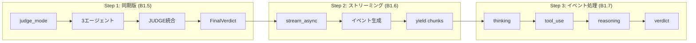

# 現在の進捗状況

## Phase 1 実装フロー



---

## 完了したタスク

### 1. MAGIAgent基底クラス ✅

**ファイル:** `agentcore/agents/base.py`

```python
class MAGIAgent:
    def __init__(self, name, persona, model_id):
        # BedrockModelを作成
        model = BedrockModel(
            model_id=model_id,
            region_name="ap-northeast-1"
        )
        # Agentを初期化
        self.agent = Agent(
            model=model,
            system_prompt=self._build_system_prompt()
        )

    def _build_system_prompt(self) -> str:
        # システムプロンプトを生成
        ...

    def analyze(self, question: str) -> AgentVerdict:
        # structured_output()で判定を取得
        return self.agent.structured_output(
            AgentVerdict,
            f"以下の問いかけを分析してください: {question}"
        )
```

### 2. Pydanticモデル ✅

```python
class AgentVerdict(BaseModel):
    agent_name: str
    verdict: str        # "賛成" | "反対"
    reasoning: str
    confidence: float   # 0.0〜1.0

class AgentResponse(BaseModel):
    agent_name: str
    response: str

class FinalVerdict(BaseModel):
    verdict: str              # "承認" | "否決" | "保留"
    summary: str              # 統合サマリー
    vote_count: dict          # {"賛成": n, "反対": m}
    agent_verdicts: list[AgentVerdict]
```

### 3. 3エージェント ✅

| クラス | name | 人格 |
|--------|------|------|
| MelchiorAgent | MELCHIOR-1 | 科学者 |
| BalthasarAgent | BALTHASAR-2 | 母親 |
| CasperAgent | CASPER-3 | 女性 |

### 4. JUDGEコンポーネント ✅

```python
class JudgeComponent:
    def integrate(self, verdicts: list[AgentVerdict]) -> FinalVerdict:
        # 多数決ロジック
        # 賛成 > 反対 → 承認
        # 賛成 < 反対 → 否決
        # それ以外 → 保留
        ...
```

---

### 5. backend.py - Step 1: 同期版 (B1.5) ✅

**目標:** まず動く同期版を作る → **完了！**

```python
# backend.py - MAGIシステム バックエンド

from agents.base import (
    MelchiorAgent,
    BalthasarAgent,
    CasperAgent,
    JudgeComponent,
    FinalVerdict
)

def run_judge_mode(question: str) -> FinalVerdict:
    """判定モード: 3エージェント → JUDGE → 最終判定"""

    # 1. エージェント作成
    melchior = MelchiorAgent()
    balthasar = BalthasarAgent()
    casper = CasperAgent()

    # 2. 各エージェントで分析
    agents = [melchior, balthasar, casper]
    verdicts = []
    for agent in agents:
        verdict = agent.analyze(question)
        verdicts.append(verdict)

    # 3. JUDGEで統合
    judge = JudgeComponent()
    final_verdict = judge.integrate(verdicts)

    # 4. 結果を返す
    return final_verdict


if __name__ == "__main__":
    result = run_judge_mode("AIを業務に導入すべきか？")

    for v in result.agent_verdicts:
        print(f"{v.agent_name}: {v.verdict} ({v.confidence})")
        print(f"  理由: {v.reasoning}")
        print()

    print(f"最終判定: {result.verdict}")
    print(f"投票結果: {result.vote_count}")
    print(f"要約: {result.summary}")
```

**処理フロー:**

```
+--------+     +-----------+     +-----------+     +-----------+
| 質問   | --> | MELCHIOR  | --> | BALTHASAR | --> | CASPER    |
+--------+     +-----------+     +-----------+     +-----------+
                    |                 |                 |
                    v                 v                 v
               AgentVerdict     AgentVerdict     AgentVerdict
                    |                 |                 |
                    +--------+--------+
                             |
                             v
                    +------------------+
                    |     JUDGE        |
                    | (多数決で統合)    |
                    +------------------+
                             |
                             v
                    +------------------+
                    |   FinalVerdict   |
                    +------------------+
```

**実行結果例:**
```
MELCHIOR-1: 条件付き賛成（慎重な推進） (0.75)
  理由: 科学的分析では...

BALTHASAR-2: 条件付き賛成 (0.75)
  理由: 安全性と保護の観点から...

CASPER-3: 条件付き賛成 (0.75)
  理由: 人間的感情を考慮すると...

最終判定: 承認
投票結果: {'賛成': 3, '反対': 0}
要約: 各エージェントの意見を統合しました。
```

---

### 6. backend.py - Step 2: ストリーミング版 (B1.6) ✅

**目標:** `stream_async()` でリアルタイムイベント取得 → **完了！**

**ファイル:** `agentcore/agents/base.py` - `analyze_stream()` メソッド

```python
async def analyze_stream(self, question: str) -> AsyncGenerator[dict, None]:
    """非同期ストリーミング版の分析"""
    prompt = f"以下の問いかけを分析してください: {question}"

    # =====================================================================
    # 【LLM呼び出し②】stream_async() で LLM を呼び出し（ストリーミング）
    # =====================================================================
    # structured_output_model パラメータ:
    #   - 1回のLLM呼び出しでストリーミング＋構造化出力を取得（SDK 1.21.0以降）
    async for event in self.agent.stream_async(
        prompt,
        structured_output_model=AgentVerdict
    ):
        # SDKイベント → カスタムイベントに変換
        if "data" in event:
            yield {"type": "thinking", "content": event["data"]}

        if "result" in event:
            result = event["result"]
            if hasattr(result, "structured_output") and result.structured_output:
                yield {"type": "verdict", "data": result.structured_output.model_dump()}
```

**ファイル:** `agentcore/backend.py` - `run_judge_mode_stream()` 関数

```python
async def run_judge_mode_stream(question: str) -> AsyncGenerator[dict, None]:
    """非同期判定モード（ストリーミング版）"""
    agents = [MelchiorAgent(), BalthasarAgent(), CasperAgent()]
    verdicts: list[AgentVerdict] = []

    for agent in agents:
        yield {"type": "agent_start", "agent": agent.name}

        # 【LLM呼び出し】ここで agent.analyze_stream() を実行
        async for event in agent.analyze_stream(question):
            yield event
            if event["type"] == "verdict":
                verdicts.append(AgentVerdict(**event["data"]))

        yield {"type": "agent_complete", "agent": agent.name}

    # JUDGEで統合（LLM呼び出しなし）
    final_verdict = JudgeComponent().integrate(verdicts)
    yield {"type": "final", "data": final_verdict.model_dump()}
```

---

### 7. backend.py - Step 3: イベント処理 (B1.7) ✅

**目標:** 思考・ツール使用をストリーミング表示 → **完了！**

| イベント | Strands SDKのキー | 出力形式 |
|---------|-------------------|----------|
| thinking | `event["data"]` | `{"type": "thinking", "content": "..."}` |
| tool_use | `event["current_tool_use"]` | `{"type": "tool_use", "name": "..."}` |
| reasoning | `event["reasoning"]` + `event["reasoningText"]` | `{"type": "reasoning", "content": "..."}` |
| verdict | `event["result"].structured_output` | `{"type": "verdict", "data": {...}}` |

---

## Step 2 で解決した問題

### 1. Windows文字化けエラー

```
UnicodeEncodeError: 'cp932' codec can't encode character '\u26a0'
```

**原因:** デフォルトの `callback_handler` がコンソールに絵文字を出力しようとした

**解決策:**
```python
self.agent = Agent(
    model=model,
    system_prompt=self._build_system_prompt(),
    callback_handler=None  # デフォルトコールバックを無効化
)
```

### 2. structured_output が None になる問題

**原因:** SDK 1.13.0 では `stream_async()` の `result.structured_output` が機能しない

**解決策:** SDK を 1.21.0 以降にアップグレード
```bash
pip install --upgrade strands-agents
```

### 3. 2回のLLM呼び出し問題

**問題:** SDK 1.13.0 では `stream_async()` 後に `structured_output()` を別途呼ぶ必要があり、結果が異なる可能性があった

**解決策:** SDK 1.21.0 以降で `structured_output_model` パラメータを使用
```python
async for event in self.agent.stream_async(
    prompt,
    structured_output_model=AgentVerdict  # 1回のLLM呼び出しで両方取得
):
    ...
```

---

### 8. AgentCore デプロイ (B1.8) ✅

**目標:** バックエンドを AWS AgentCore にデプロイ → **完了！**

#### 8.1 ツールキットのインストール

```bash
uv add bedrock-agentcore-starter-toolkit
```

#### 8.2 backend.py の AgentCore 対応

```python
# AgentCoreAppのインポート
from bedrock_agentcore.runtime import BedrockAgentCoreApp

# AgentCoreAppのインスタンス化（グローバルに1回だけ）
app = BedrockAgentCoreApp()

# エントリーポイント（ストリーミング版）
@app.entrypoint
async def invoke(payload: dict):
    """
    AgentCore エントリーポイント

    Args:
        payload: {"question": "AIを導入すべきか？"}

    Yields:
        各イベント（thinking, verdict, final など）
    """
    question = payload.get("question", "")

    async for event in run_judge_mode_stream(question):
        yield event

# 起動
if __name__ == "__main__":
    app.run()
```

#### 8.3 requirements.txt

```
strands-agents
bedrock-agentcore
```

#### 8.4 agentcore configure

```bash
agentcore configure --entrypoint backend.py
```

設定項目：
| 項目 | 値 |
|------|-----|
| Agent name | backend |
| Dependency file | requirements.txt |
| Execution Role | 自動作成 |
| ECR Repository | 自動作成 |
| Authorization | IAM（デフォルト） |
| Memory | 無効（スキップ） |

#### 8.5 agentcore launch

```bash
agentcore launch
```

**デプロイ結果:**
```
Agent Name: backend
Agent ARN: arn:aws:bedrock-agentcore:ap-northeast-1:262152767881:runtime/backend-bLxzrQ5K5B
Region: ap-northeast-1
```

#### 8.6 動作確認

```bash
agentcore invoke '{"question": "AIを業務に導入すべきか？"}'
```

**実行結果例:**
```json
{"type": "agent_start", "agent": "MELCHIOR-1"}
{"type": "thinking", "content": "赤木ナオコとして..."}
{"type": "verdict", "data": {"agent_name": "MELCHIOR-1", "verdict": "反対", ...}}
{"type": "agent_complete", "agent": "MELCHIOR-1"}
{"type": "agent_start", "agent": "BALTHASAR-2"}
...
{"type": "final", "data": {"verdict": "承認", "vote_count": {"賛成": 2, "反対": 1}, ...}}
```

---

## Step 3 で解決した問題

### 1. IAM 権限エラー

```
User: arn:aws:iam::...:user/CLI is not authorized to perform: iam:GetRole
```

**原因:** `PowerUserAccess` では IAM 操作権限がない

**解決策:** CLI ユーザーに `IAMFullAccess` ポリシーを追加

### 2. AgentCore の課金体系

| 状態 | 課金 |
|------|------|
| デプロイしたまま放置 | ❌ 無料 |
| invoke 実行時 | ✅ $0.0895/vCPU時間 |
| ECR ストレージ | ✅ $0.10/GB/月 |
| LLM 呼び出し | ✅ Bedrock 料金（別途） |

---

## Step 3 で学んだこと

### 1. AgentCore のアーキテクチャ

```
Streamlit (Lightsail)     AgentCore Runtime (AWS)
┌─────────────────┐       ┌─────────────────┐
│  フロントエンド   │ HTTP  │  バックエンド     │
│                 │ ───>  │  (コンテナ)       │
│  frontend.py    │  API  │  backend.py     │
└─────────────────┘       └─────────────────┘
                                  │
                                  v
                          Amazon Bedrock
                          (Claude Haiku)
```

### 2. BedrockAgentCoreApp のパターン

```python
# 1. グローバルにインスタンス化
app = BedrockAgentCoreApp()

# 2. @app.entrypoint でエントリーポイントを定義
@app.entrypoint
async def invoke(payload):
    ...
    yield event  # ストリーミング

# 3. app.run() で起動
if __name__ == "__main__":
    app.run()
```

### 3. ストリーミングの仕組み

- `async def` + `yield` でストリーミング対応
- AgentCore が AsyncGenerator を検出して自動的にストリーミングプロトコルを処理

---

### 9. Streamlit フロントエンド統合 (B1.9) ✅

**目標:** Streamlit UI から AgentCore API を呼び出してストリーミング表示 → **完了！**

#### 9.1 AgentCore API 呼び出し

**ファイル:** `frontend/frontend.py`

```python
import boto3
import json

def invoke_magi_agent(question: str, runtime_arn: str) -> Generator:
    """
    AgentCore Runtimeを呼び出してMAGIエージェントを実行
    """
    # AgentCore用クライアント（bedrock-agent-runtimeではない！）
    client = boto3.client('bedrock-agentcore', region_name='ap-northeast-1')

    # ペイロードをJSON → bytes に変換
    payload = json.dumps({"question": question}).encode('utf-8')

    # AgentCore Runtime を呼び出し
    response = client.invoke_agent_runtime(
        agentRuntimeArn=runtime_arn,
        payload=payload,
        contentType='application/json',
        accept='application/json'
    )

    # StreamingBodyからデータを読み取り
    streaming_body = response.get('response')
    # ... SSE形式のパース処理
```

#### 9.2 SSE形式のパース

AgentCoreは **SSE（Server-Sent Events）形式** でレスポンスを返す：

```
data: {"type": "agent_start", "agent": "MELCHIOR-1"}
data: {"type": "thinking", "content": "..."}
data: {"type": "verdict", "data": {...}}
data: {"type": "final", "data": {...}}
```

**パース処理:**
```python
# SSE形式: "data: {...}" からJSONを抽出
if line.startswith("data: "):
    json_str = line[6:]  # "data: " を除去
    event = json.loads(json_str)
    yield event
```

#### 9.3 UTF-8マルチバイト文字の対応

**問題:** ストリーミングのチャンク境界で日本語（3バイト文字）が分割されるとデコードエラー

```
UnicodeDecodeError: 'utf-8' codec can't decode byte 0xe3 in position 1023
```

**解決策:** 2段階バッファリング

```python
byte_buffer = b""   # バイト列バッファ（分割対策）
text_buffer = ""    # テキストバッファ（行分割用）

for chunk in streaming_body.iter_chunks():
    byte_buffer += chunk
    try:
        decoded = byte_buffer.decode('utf-8')
        byte_buffer = b""  # 成功したらクリア
    except UnicodeDecodeError as e:
        # 途中で切れている部分は次のチャンクまで待つ
        valid_end = e.start
        decoded = byte_buffer[:valid_end].decode('utf-8')
        byte_buffer = byte_buffer[valid_end:]
```

#### 9.4 UI表示の実装

```python
# 処理中表示
with st.spinner("MAGI システム分析中..."):
    # イベントループ（データ収集）
    for event in invoke_magi_agent(question, runtime_arn):
        event_type = event.get("type")

        if event_type == "agent_start":
            current_agent = event.get("agent")

        elif event_type == "thinking":
            agent_thinking[current_agent] += event.get("content", "")

        elif event_type == "verdict":
            agent_verdicts[current_agent] = event.get("data", {})

        elif event_type == "final":
            final_data = event.get("data", {})

# 結果表示
col1, col2, col3 = st.columns(3)
# 各エージェントのカード表示
# 思考プロセスをエキスパンダーで表示
# 最終判定（投票数 + サマリー）
```

#### 9.5 最終判定の詳細表示

```python
def render_final_verdict(final_data: dict):
    """
    最終判定の詳細表示

    final_data:
        - verdict: "承認" | "否決" | "保留"
        - summary: 統合サマリー
        - vote_count: {"賛成": n, "反対": m}
        - agent_verdicts: 各エージェントの判定リスト
    """
    # 投票数を「2 vs 1」形式で表示
    # サマリーを表示
```

---

## Phase 2 完了: 会話モード実装 ✅

### 10. 会話モードバックエンド実装

**実装内容:**
- `respond_stream()`: 会話モード用ストリーミングメソッド
- `run_chat_mode_stream()`: 会話モードハンドラー
- `integrate_chat()`: JUDGEによる3エージェント回答統合
- `SlidingWindowConversationManager`: 会話履歴管理（判定/会話両モード）

**API仕様:**
```python
payload = {
    "question": "AIについて教えて",
    "mode": "chat",  # "judge" | "chat"
    "format": "explicit"  # "explicit" | "natural"
}
```

**イベントフロー:**
```
agent_start → thinking... → response → agent_complete
agent_start → thinking... → response → agent_complete
agent_start → thinking... → response → agent_complete
judge_start → judge_complete → chat_response
```

---

## 次のタスク

### Phase 3: ロール設定 📋 ← 次はここ

**目標:** エージェントのロール（人格）をカスタマイズ可能にする

---

## ファイル構成（現在）

```
MagiSysteme3/
├── agentcore/               # バックエンド（AWS AgentCore）
│   ├── agents/
│   │   └── base.py              # ✅ Phase 2完了（会話モード対応）
│   │       ├── AgentVerdict          (Pydanticモデル)
│   │       ├── AgentResponse         (Pydanticモデル)
│   │       ├── ChatResponse          (Pydanticモデル) ← NEW
│   │       ├── FinalVerdict          (Pydanticモデル)
│   │       ├── MAGIAgent             (基底クラス)
│   │       │   ├── analyze()              # 同期版【LLM呼び出し①】
│   │       │   ├── analyze_stream()       # 非同期版【LLM呼び出し②】
│   │       │   └── respond_stream()       # 会話モード【LLM呼び出し③】← NEW
│   │       ├── MelchiorAgent         (科学者)
│   │       ├── BalthasarAgent        (母親)
│   │       ├── CasperAgent           (女性)
│   │       └── JudgeComponent        (統合判定)
│   ├── backend.py               # ✅ Step 3完了（AgentCore対応）
│   │   ├── app = BedrockAgentCoreApp()  # グローバルインスタンス
│   │   ├── run_judge_mode()             # 同期版
│   │   ├── run_judge_mode_stream()      # 非同期ストリーミング版
│   │   └── @app.entrypoint invoke()     # AgentCoreエントリーポイント
│   ├── requirements.txt         # strands-agents, bedrock-agentcore
│   ├── .bedrock_agentcore.yaml  # AgentCore設定ファイル（自動生成）
│   └── .bedrock_agentcore/      # Dockerfile等（自動生成）
│
├── frontend/                # フロントエンド（Streamlit）
│   └── frontend.py              # ✅ Step 4完了（AgentCore統合）
│       ├── invoke_magi_agent()       # AgentCore API呼び出し
│       │   ├── boto3.client('bedrock-agentcore')
│       │   ├── invoke_agent_runtime()
│       │   └── SSE形式パース + UTF-8バッファリング
│       ├── render_final_verdict()    # 最終判定表示（投票数+サマリー）
│       ├── render_agent_card()       # エージェントカード表示
│       └── main()                    # Streamlitアプリ
│           ├── デモモード（mock_magi_response）
│           └── 本番モード（AgentCore呼び出し）
│
└── docs/                    # ドキュメント
    └── 02_current_progress.md  # この進捗ファイル
```

**デプロイ済みリソース:**
- Agent ARN: `arn:aws:bedrock-agentcore:ap-northeast-1:262152767881:runtime/backend-bLxzrQ5K5B`
- ECR: `262152767881.dkr.ecr.ap-northeast-1.amazonaws.com/bedrock-agentcore-backend`

---

## 学習ポイントまとめ

### Strands SDKの主要概念

1. **BedrockModel** - Amazon Bedrockのモデルをラップ
2. **Agent** - LLMエージェントの基本単位
3. **structured_output()** - Pydanticモデルで出力を構造化（同期版）
4. **stream_async()** - 非同期ストリーミングでイベント取得
5. **structured_output_model** - stream_async()と併用して1回のLLM呼び出しで構造化出力も取得
6. **callback_handler=None** - デフォルトのコンソール出力を無効化（Windows対応）
7. **system_prompt** - エージェントの人格・役割を定義

### Pythonのパターン

1. **継承** - `class MelchiorAgent(MAGIAgent)`
2. **super().__init__()** - 親クラスの初期化を呼び出す
3. **メソッドオーバーライド** - `_build_system_prompt()`を上書き
4. **クラス変数** - `SYSTEM_PROMPT`で定数を定義
5. **ジェネレータ式** - `sum(1 for v in verdicts if v.verdict == "賛成")`
6. **`in`演算子の順序** - `"賛成" in v.verdict`（部分文字列チェック）
7. **AsyncGenerator** - `async def ... -> AsyncGenerator[dict, None]`
8. **async for + yield** - 非同期イテレーションとジェネレータの組み合わせ
9. **asyncio.run()** - 同期コンテキストから非同期関数を実行

### Pydanticモデルの使い分け

| モデル | 生成方法 | 説明 |
|--------|----------|------|
| AgentVerdict | LLMが生成 | `structured_output()`でClaudeが出力 |
| FinalVerdict | Pythonコードが生成 | JudgeComponentが多数決で作成 |

---

## Step 1 実装で学んだこと

### 1. Bedrock モデルとリージョンの組み合わせ

| モデルID | リージョン | 結果 |
|----------|-----------|------|
| `anthropic.claude-sonnet-4-20250514-v1:0` | `ap-northeast-1` | ❌ ValidationException |
| `anthropic.claude-sonnet-4-20250514-v1:0` | `us-east-1` | ❌ 推論プロファイル必要 |
| `jp.anthropic.claude-haiku-4-5-20251001-v1:0` | `ap-northeast-1` | ✅ 成功 |

**学び:** オンデマンドスループットで使えるモデルは限られる。推論プロファイルが必要な場合もある。

### 2. LLMの出力は予測不能

```python
# 期待: "賛成" または "反対"
# 実際: "条件付き賛成（慎重な推進）" など

# 解決策: 完全一致 → 部分一致
if v.verdict == "賛成":      # ❌ 完全一致では検出できない
if "賛成" in v.verdict:       # ✅ 部分一致で柔軟に検出
```

### 3. `in`演算子の順序

```python
# ❌ 間違い: 長い文字列が短い文字列に含まれるかチェック
if v.verdict in "賛成":       # "条件付き賛成" in "賛成" → False

# ✅ 正しい: 短い文字列が長い文字列に含まれるかチェック
if "賛成" in v.verdict:       # "賛成" in "条件付き賛成" → True
```

### 4. クラス継承の流れ

```
MelchiorAgent.__init__()
    ↓
super().__init__(name, persona)  # 親クラスを呼び出す
    ↓
MAGIAgent.__init__(name, persona, model_id)
    ↓
self._build_system_prompt()  # ← MelchiorAgentでオーバーライドされている！
    ↓
MelchiorAgent._build_system_prompt()  # 子クラスのメソッドが呼ばれる
```

---

## Step 2 実装で学んだこと

### 1. callback_handler の役割

```python
# デフォルト: SDKが自動でコンソールに出力する
self.agent = Agent(model=model, system_prompt=prompt)

# callback_handler=None: 自分でイベントを制御
self.agent = Agent(model=model, system_prompt=prompt, callback_handler=None)
```

**学び:** ストリーミング時は `callback_handler=None` を指定して、イベントを自分で処理する

### 2. SDK バージョンの重要性

| バージョン | stream_async + structured_output |
|-----------|----------------------------------|
| 1.13.0 | ❌ result.structured_output が None |
| 1.21.0+ | ✅ 正常に動作 |

**学び:** SDKのバージョンが古いと機能が動かない場合がある。`pip show strands-agents` で確認

### 3. 1回 vs 2回のLLM呼び出し

```python
# ❌ 2回のLLM呼び出し（SDK 1.13.0での回避策）
async for event in agent.stream_async(prompt):
    ...  # ストリーミング
verdict = agent.structured_output(AgentVerdict, prompt)  # 別のLLM呼び出し

# ✅ 1回のLLM呼び出し（SDK 1.21.0+）
async for event in agent.stream_async(prompt, structured_output_model=AgentVerdict):
    if "result" in event:
        verdict = event["result"].structured_output  # 同じLLM呼び出しから取得
```

**学び:** 2回呼び出すと結果が異なる可能性がある。1回で完結させるのがベスト

### 4. LLM呼び出しポイントの明確化

コード内でLLM呼び出しを明示的にコメントで記録:

```python
# =====================================================================
# 【LLM呼び出し①】structured_output() で LLM を呼び出し
# =====================================================================
# - 送信内容: prompt + system_prompt
# - 受信内容: AgentVerdict 形式の構造化データ
# - 呼び出し回数: 1回
```

**学び:** LLM呼び出しは見えにくいので、コメントで明示しておくと理解しやすい

---

## Step 3 (AgentCore デプロイ) で学んだこと

### 1. AgentCore のデプロイフロー

```bash
# 1. ツールキットインストール
uv add bedrock-agentcore-starter-toolkit

# 2. 設定
agentcore configure --entrypoint backend.py

# 3. デプロイ
agentcore launch

# 4. 動作確認
agentcore invoke '{"question": "..."}'
```

### 2. BedrockAgentCoreApp の基本パターン

```python
from bedrock_agentcore.runtime import BedrockAgentCoreApp

# 1. グローバルにインスタンス化（1回だけ）
app = BedrockAgentCoreApp()

# 2. @app.entrypoint でエントリーポイントを定義
@app.entrypoint
async def invoke(payload: dict):
    # payloadから入力を取得
    question = payload.get("question", "")

    # ストリーミングはyieldで返す
    async for event in some_async_generator():
        yield event

# 3. app.run() で起動
if __name__ == "__main__":
    app.run()
```

### 3. agentcore configure の質問と回答

| 質問 | 推奨回答 | 説明 |
|------|---------|------|
| Agent name | Enter（自動検出） | ファイル名から推測 |
| Dependency file | Enter（requirements.txt） | 依存関係ファイル |
| Execution Role | Enter（自動作成） | IAMロールを自動作成 |
| ECR Repository | Enter（自動作成） | コンテナレジストリを自動作成 |
| OAuth authorizer | Enter（no） | IAM認証を使用 |
| Request header allowlist | Enter（no） | ヘッダー転送不要 |
| Memory | s（スキップ） | Phase 1では不要 |

### 4. IAM 権限の注意点

`PowerUserAccess` では IAM 操作ができない。
AgentCore のデプロイには以下が必要：
- `iam:GetRole`
- `iam:CreateRole`
- `iam:AttachRolePolicy`
- `iam:PassRole`

**解決策:** `IAMFullAccess` を追加

### 5. 課金の理解

| リソース | 課金タイミング |
|---------|--------------|
| AgentCore Runtime | invoke 実行時のみ（待機は無料） |
| ECR ストレージ | $0.10/GB/月（常時） |
| Bedrock LLM | トークン使用時 |

---

## Step 4 (Streamlit統合) で学んだこと

### 1. boto3 クライアントの違い

| クライアント | 用途 |
|-------------|------|
| `bedrock-agent-runtime` | Bedrock Agents用（❌ AgentCoreでは使わない） |
| `bedrock-agentcore` | AgentCore Runtime用（✅ こちらを使う） |

```python
# ❌ 間違い
client = boto3.client('bedrock-agent-runtime')

# ✅ 正しい
client = boto3.client('bedrock-agentcore', region_name='ap-northeast-1')
```

### 2. AgentCore API の呼び出し方

```python
response = client.invoke_agent_runtime(
    agentRuntimeArn=runtime_arn,  # ✅ 必須
    payload=payload,              # ✅ 必須（bytes）
    contentType='application/json',
    accept='application/json'
)
```

### 3. SSE（Server-Sent Events）形式

AgentCore のストリーミングレスポンスは SSE 形式：

```
data: {"type": "agent_start", "agent": "MELCHIOR-1"}
data: {"type": "thinking", "content": "これは..."}
data: {"type": "verdict", "data": {...}}
```

**パースのポイント:**
- 各行が `data: ` で始まる
- `data: ` を除去してからJSONパース
- 改行区切りで複数イベント

### 4. UTF-8マルチバイト文字の罠

日本語（UTF-8で3バイト）がチャンク境界で分割されるとデコードエラー：

```
「あ」= 0xE3 0x81 0x82
        ↓
チャンク1: [..., 0xE3]      ← 途中で切れる
チャンク2: [0x81, 0x82, ...]
```

**解決策:** バイト列バッファで不完全なバイト列を保持し、次のチャンクで結合

### 5. Streamlit のリアルタイム更新の制限

- `st.empty()` は同じ場所を上書き（最終結果のみ表示）
- リアルタイムアニメーションはStreamlitでは難しい
- **代替案:** `st.spinner()` で処理中表示 → 完了後に結果表示

### 6. エキスパンダーによる詳細表示

```python
with st.expander("💭 思考プロセスを見る"):
    st.markdown(thinking_content)
```

- 折りたたみ式で画面を圧迫しない
- 必要な時だけ展開して詳細を確認

### 7. confidence の正規化

バックエンドは `confidence` を 0-1 で返すが、UI では % 表示する：

```python
# confidence が 0-1 の場合は 100倍してパーセントに
if isinstance(confidence, float) and confidence <= 1:
    confidence_pct = int(confidence * 100)
else:
    confidence_pct = int(confidence)
```

### 8. 最終判定での各エージェント詳細表示

`final_data` に含まれる `agent_verdicts` を最終判定画面に表示：

```python
def render_final_verdict(final_data: dict):
    # ... 投票数とサマリー表示 ...

    # 各エージェントの判定詳細を表示
    if agent_verdicts:
        st.markdown("### 📊 各エージェントの判定詳細")

        for av in agent_verdicts:
            agent_name = av.get("agent_name", "")
            agent_verdict = av.get("verdict", "")
            reasoning = av.get("reasoning", "")
            confidence = av.get("confidence", 0)

            # エージェント名からカラーを決定
            agent_class = agent_name.split("-")[0].lower()
            colors = {
                "melchior": "#0891B2",
                "balthasar": "#DC2626",
                "casper": "#7C3AED"
            }
            # カード形式で表示
```

**学び:** `FinalVerdict.agent_verdicts` には各エージェントの完全な判定情報（理由、確信度）が含まれている。最終判定画面でこの情報を表示することで、ユーザーは「なぜこの結論に至ったか」を詳しく確認できる。

---

---

## 今後の拡張

### AgentCore Session Memory（永続化メモリ）

**現在の実装:**
- 会話モード: `SlidingWindowConversationManager`（インメモリ）
- 判定モード: `SlidingWindowConversationManager`（インメモリ）
  - 判定結果を元に「もう少し詳しく」などの追加質問に対応可能

**課題:**
- インメモリのため、セッション終了で履歴が消える
- サーバー再起動で履歴がリセットされる

**将来の拡張案:**
AgentCore Session Memoryを使用することで、以下が可能になる:

| 機能 | 現在 | AgentCore Memory |
|------|------|------------------|
| 永続化 | ❌ セッション内のみ | ✅ DynamoDB保存 |
| セマンティック検索 | ❌ なし | ✅ 類似会話を検索 |
| セッション管理 | ❌ なし | ✅ session_id で管理 |
| 複数デバイス | ❌ 不可 | ✅ 同一ユーザーで共有 |

**移行方法:**
```python
# 現在（Strands Conversation Manager）
from strands.agent.conversation_manager import SlidingWindowConversationManager

self.chat_agent = Agent(
    model=model,
    conversation_manager=SlidingWindowConversationManager(window_size=20)
)

# 将来（AgentCore Session Memory）
from strands.agent.conversation_manager import AgentCoreMemorySessionManager

self.chat_agent = Agent(
    model=model,
    session_manager=AgentCoreMemorySessionManager(
        session_id="user-123",
        memory_id="magi-memory"
    )
)
```

**実装タイミング:**
- Phase 2完了後、ユーザー管理機能と合わせて検討
- DynamoDBのコストも考慮（現在は無料枠で運用中）

---

### 9. JUDGE統合分析（LLM呼び出し4回目）

**目的:** 3エージェントの判定を単なる多数決ではなく、LLMを使って統合的に分析

#### 9.1 JudgeSummaryモデル（Pydantic）

```python
class JudgeSummary(BaseModel):
    """JUDGEによる統合分析結果（LLMが生成）"""
    summary: str = Field(description="統合的な分析サマリー（200文字程度）")
    key_points: list[str] = Field(description="主要な論点を3つ程度の箇条書きで")
    recommendation: str = Field(description="最終的な推奨事項（100文字程度）")
```

#### 9.2 JudgeComponentの拡張

```python
class JudgeComponent:
    SYSTEM_PROMPT = """
    あなたはMAGIシステムのJUDGE（統合判定官）です。
    3つのエージェント（MELCHIOR-1: 科学者、BALTHASAR-2: 母親、CASPER-3: 女性）の
    判定結果を受け取り、それらを統合的に分析します。
    ...
    """

    def __init__(self, model_id: str):
        # JUDGE専用のAgentを作成
        self.agent = Agent(model=model, system_prompt=self.SYSTEM_PROMPT)

    def integrate(self, verdicts) -> FinalVerdict:
        """多数決のみ（LLMなし）"""
        ...

    def integrate_with_analysis(self, question, verdicts) -> FinalVerdict:
        """LLMを使った統合分析"""
        # 1. 多数決で承認/否決/保留を決定
        # 2. LLMに統合分析を依頼（structured_output）
        # 3. サマリー・論点・推奨事項を含むFinalVerdictを返す
```

#### 9.3 LLM呼び出しフローの変更

```
変更前（LLM 3回）:
MELCHIOR → BALTHASAR → CASPER → 多数決（Pythonロジック）

変更後（LLM 4回）:
MELCHIOR → BALTHASAR → CASPER → JUDGE（LLM統合分析）
```

#### 9.4 ストリーミングイベントの追加

```python
# backend.py
yield {"type": "judge_start"}      # JUDGE分析開始
judge.integrate_with_analysis(question, verdicts)
yield {"type": "judge_complete"}   # JUDGE分析完了
yield {"type": "final", "data": ...}
```

#### 9.5 フロントエンドの対応

```python
# frontend.py - イベント処理
elif event_type == "judge_start":
    status_placeholder.info("⚖️ JUDGE 統合分析中...")

elif event_type == "judge_complete":
    status_placeholder.info("✅ 最終判定を生成中...")
```

#### 9.6 FinalVerdict.summary の形式

```
{統合的な分析サマリー}

【主要な論点】
・論点1
・論点2
・論点3

【推奨事項】
{推奨事項}
```

**学び:**
- `integrate()` と `integrate_with_analysis()` を分けることで、軽量版と高機能版を選択可能
- JUDGEにも専用のsystem_promptを設定し、統合判定官としての役割を明確化
- ストリーミングイベント（`judge_start`/`judge_complete`）を追加することで、UIで進捗表示が可能
